## 1. 每个单词的首字母大写
*   要点：通过 `text-transform` 调正文字
*   场景：每个单词的首字母大写，摆脱一味 `JS` 的控制
*   兼容：all：[text-transform](https://caniuse.com/#search=text-transform)
*   代码：[在线演示](http://js.jirengu.com/popuc/2/edit?html,css,output)

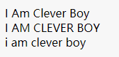


## 2.使用input:checked单选高亮
*   要点：通过 `input:checked` 单选高亮
*   场景：单选高亮（之前做 pc 端的客户画像需求时，遇到需要左右两边等到的需求（左边块的高度会随着内容变化）），摆脱一味 `JS` 的控制
*   兼容：[text-transform](https://caniuse.com/#search=%3Achecked)
*   代码：[在线演示](http://js.jirengu.com/lewoc/5/edit?html,css,output)

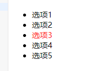


## 3.使用vw定制rem自适应布局
*   要点：移动端使用`rem布局`需要通过JS设置不同屏幕宽高比的`font-size`，结合`vw`单位和`calc()`可脱离JS的控制
*   场景：**rem页面布局**(不兼容低版本移动端系统)
*   兼容：[vw](https://caniuse.com/#search=vw)、[calc()](https://caniuse.com/#search=calc())

## 4.使用writing-mode排版竖文

*   要点：通过`writing-mode`调整文本排版方向
*   场景：**竖行文字**、**文言文**、**诗词**
*   兼容：[writing-mode](https://caniuse.com/#search=writing-mode)
*   代码：[在线演示](http://js.jirengu.com/quqon/2/edit?html,css,output)

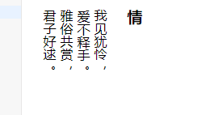


## 5.使用text-align-last对齐两端文本

*   要点：通过`text-align-last:justify`设置文本两端对齐
*   场景：**未知字数中文对齐**
*   兼容：[text-align-last](hhttps://caniuse.com/#search=text-align-last)
*   代码：[在线演示](http://js.jirengu.com/punim/3/edit?html,css,output)

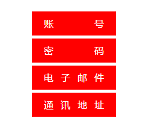


## 6.使用object-fit规定图像尺寸

*   要点：通过`object-fit`使图像脱离`background-size`的约束，使用``来标记图像背景尺寸
*   场景：**图片尺寸自适应**
*   兼容：[object-fit](https://caniuse.com/#search=object-fit)
*   代码：[在线演示](http://js.jirengu.com/maxuz/5/edit?html,css,output)

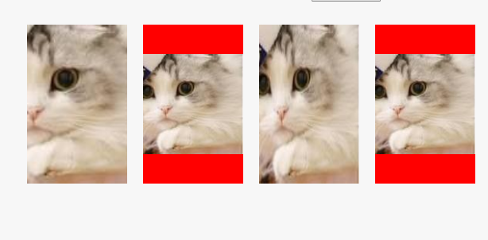


## 7.使用text-overflow控制文本溢出

*   要点：通过`text-overflow:ellipsis`对溢出的文本在末端添加`...`
*   场景：**单行文字溢出**、**多行文字溢出**
*   兼容：[text-overflow](https://caniuse.com/#search=text-overflow)、[line-clamp](https://caniuse.com/#search=line-clamp)、[box-orient](https://developer.mozilla.org/zh-CN/docs/Web/CSS/box-orient)
*   代码：[在线演示](http://js.jirengu.com/vituj/4/edit?html,css,output)

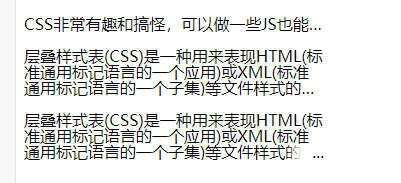


## 8.使用letter-spacing排版倒序文本

*   要点：通过`letter-spacing`设置负值字体间距将文本倒序
*   场景：**文言文**、**诗词**
*   兼容：[letter-spacing](https://caniuse.com/#search=letter-spacing)
*   代码：[在线演示](http://js.jirengu.com/vurer/1/edit?html,css,output)

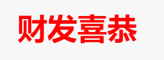

## 9.使用margin-left排版左重右轻列表

*   要点：使用`flexbox横向布局`时，最后一个元素通过`margin-left:auto`实现向右对齐
*   场景：**右侧带图标的导航栏**
*   兼容：[margin](https://caniuse.com/#search=margin)
*   代码：[在线演示](http://js.jirengu.com/nocuh/3/edit?html,css,output)

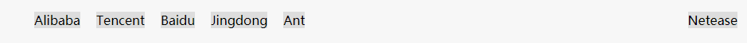

## 10.使用overflow-scrolling支持弹性滚动

*   要点：iOS页面非 `body` 元素的滚动操作会非常卡( `Android` 不会出现此情况)，通过 `overflow-scrolling:touch` 调用 `Safari` 原生滚动来支持弹性滚动，增加页面滚动的流畅度
*   场景：iOS页面滚动
*   兼容：iOS自带 `-webkit-overflow-scrolling`
```
body {
    -webkit-overflow-scrolling: touch;
}
.elem {
    overflow: auto;
}
```

## 11.使用transform启动GPU硬件加速
*   要点：有时执行动画可能会导致页面卡顿，可在特定元素中使用硬件加速来避免这个问题
*   场景：**动画元素**(绝对定位、同级中超过6个以上使用动画)
*   兼容：[transform](https://caniuse.com/#search=transform)
```
.element {
    transform: translate3d(0, 0, 0); /* translateZ(0)亦可 */
}
```

## 12.使用pointer-events禁用事件触发

*   要点：通过`pointer-events:none`禁用事件触发(默认事件、冒泡事件、鼠标事件、键盘事件等)，相当于`<button>`的`disabled`
*   场景：**限时点击按钮**(发送验证码倒计时)、**事件冒泡禁用**(多个元素重叠且自带事件、a标签跳转)
*   兼容：[pointer-events](https://caniuse.com/#search=pointer-events)
*   代码：[在线演示](http://js.jirengu.com/mebum/5/edit?html,css,js,output)

## 13.使用:valid和:invalid校验表单

*   要点：`<input>`使用伪类`:valid`和`:invalid`配合`pattern`校验表单输入的内容
*   场景：**表单校验**
*   兼容：[pattern](https://caniuse.com/#search=pattern)、[:valid](https://caniuse.com/#search=%3Avalid)、[:invalid](https://caniuse.com/#search=%3Ainvalid)
*   代码：[在线演示](http://js.jirengu.com/pexah/6/edit?html,css,output)

## 14.使用:focus-within分发冒泡响应

*   要点：表单控件触发`focus`和`blur`事件后往父元素进行冒泡，在父元素上通过`:focus-within`捕获该冒泡事件来设置样式
*   场景：**登录注册弹框**、**表单校验**、[**离屏导航**](https://link.juejin.im?target=https%3A%2F%2Fcodepen.io%2Fdannievinther%2Fpen%2FNvZjvz)、[**导航切换**](https://link.juejin.im?target=https%3A%2F%2Fcodepen.io%2FChokcoco%2Fpen%2FRJEpaP)
*   兼容：[:focus-within](https://www.caniuse.com/#search=%3Afocus-within)、[:placeholder-shown](https://www.caniuse.com/#search=%3Aplaceholder-shown)
*   代码：[在线演示](http://js.jirengu.com/cafah/2/edit?html,css,output)

## 15.使用color改变边框颜色

*   要点：`border`没有定义`border-color`时，设置`color`后，`border-color`会被定义成`color`
*   场景：**边框颜色与文字颜色相同**
*   兼容：[color](https://caniuse.com/#search=color)
```
.elem {
    border: 1px solid;
    color: #f66;
}
```

## 16.使用filter开启悼念模式

*   要点：通过`filter:grayscale()`设置灰度模式来悼念某位去世的仁兄或悼念因灾难而去世的人们
*   场景：**网站悼念**
*   兼容：[filter](https://caniuse.com/#search=filter)

```
html {
	filter: grayscale(100%);
}
```


## 17.使用::selection改变文本选择颜色

*   要点：通过`::selection`根据主题颜色自定义文本选择颜色
*   场景：**主题化**
*   兼容：[::selection](https://caniuse.com/#search=%3A%3Aselection)
*   代码：[在线演示](http://js.jirengu.com/nitix/2/edit?html,css,output)

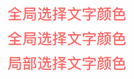

## 18.使用linear-gradient控制文本渐变


*   要点：通过`linear-gradient`设置背景渐变色，配合`background-clip:text`对背景进行文本裁剪，添加滤镜动画
*   场景：**主题化**、**特色标题**
*   兼容：[gradient](https://caniuse.com/#search=gradient)、[background-clip](https://www.caniuse.com/#search=background-clip)、[filter](https://caniuse.com/#search=filter)、[animation](https://www.caniuse.com/#search=animation)、[text-fill-color](https://www.caniuse.com/#search=text-fill-color)
*   代码：[在线演示](http://js.jirengu.com/jireg/3/)


## 19.使用transform模拟视差滚动

*   要点：通过`background-attachment:fixed`或`transform`让多层背景以不同的速度移动，形成立体的运动效果
*   场景：[**页面滚动**](https://codepen.io/Chokcoco/pen/JBaQoY)、[**视差滚动文字阴影**](https://codepen.io/Chokcoco/pen/XBgBBp)、[**视差滚动文字虚影**](https://codepen.io/Chokcoco/pen/PBXwdX)
*   兼容：[background-attachment](https://www.caniuse.com/#search=background-attachment)、[transform](https://www.caniuse.com/#search=transform)
*   代码：[在线演示](https://codepen.io/melonxx/pen/LYPOMNj)

## 20.使用linear-gradient控制背景渐变

*   要点：通过`linear-gradient`设置背景渐变色并放大背景尺寸，添加背景移动效果
*   场景：**主题化**、**彩虹背景墙**
*   兼容：[gradient](https://caniuse.com/#search=gradient)、[animation](https://www.caniuse.com/#search=animation)
*   代码：[在线演示](http://js.jirengu.com/sacol/2/edit?html,css,output)


## 21.使用animation-delay保留动画起始帧

*   要点：通过`transform-delay`或`animation-delay`设置负值时延保留动画起始帧，让动画进入页面不用等待即可运行
*   场景：**开场动画**
*   兼容：[transform](https://www.caniuse.com/#search=transform)、[animation](https://www.caniuse.com/#search=animation)
*   代码：[在线演示](http://js.jirengu.com/geyol/4/edit?html,css,output)


## 22.使用caret-color改变光标颜色

*   要点：通过`caret-color`根据主题颜色自定义光标颜色
*   场景：**主题化**
*   兼容：[caret-color](https://caniuse.com/#search=caret-color)
*   代码：[在线演示](http://js.jirengu.com/ribag/3/edit?html,css,output)

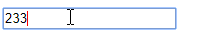

## 23.使用box-shadow裁剪图像

*   要点：通过`box-shadow`模拟蒙层实现中间镂空
*   场景：**图片裁剪**、**新手引导**、**背景镂空**、**投射定位**
*   兼容：[box-shadow](https://caniuse.com/#search=box-shadow)
*   代码：[在线演示](https://codepen.io/JowayYoung/pen/zYONxRG)

## 24.滚动指示器

*   要点：提示滚动进度的指示器
*   场景：[**阅读进度**](https://codepen.io/MadeByMike/pen/ZOrEmr)
*   兼容：[calc()](https://caniuse.com/#search=calc())、[gradient](https://caniuse.com/#search=gradient)
*   代码：[在线演示](https://codepen.io/JowayYoung/pen/ExYPMog)

## 25.换色器

*   要点：通过拾色器改变图像色相的换色器
*   场景：**图片色彩变换**
*   兼容：[mix-blend-mode](https://www.caniuse.com/#search=mix-blend-mode)
*   代码：[在线演示](https://codepen.io/JowayYoung/pen/vYBLqBm)

## 26.倒影加载条

*   要点：带有渐变倒影的加载条
*   场景：**加载提示**
*   兼容：[box-reflect](https://caniuse.com/#search=box-reflect)、[animation](https://www.caniuse.com/#search=animation)
*   代码：[在线演示](https://codepen.io/JowayYoung/pen/GRKZzpg)


## 27.动态边框

*   要点：鼠标悬浮时动态渐变显示的边框
*   场景：**悬浮按钮**、**边框动画**
*   兼容：[gradient](https://caniuse.com/#search=gradient)
*   代码：[在线演示](https://codepen.io/JowayYoung/pen/qBWZPvE)

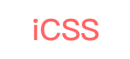

## 28.立体按钮

*   要点：点击呈现按下状态的按钮
*   场景：**按钮点击**
*   兼容：[box-shadow](https://caniuse.com/#search=box-shadow)
*   代码：[在线演示](https://codepen.io/JowayYoung/pen/PoYpaLL)


## 29.自适应相册

*   要点：自适应照片数量的相册
*   场景：**九宫格相册**、**微信相册**、**图集**
*   兼容：[:only-child](https://caniuse.com/#search=%3Aonly-child)、[:first-child](https://caniuse.com/#search=%3Afirst-child)、[:nth-child()](https://caniuse.com/#search=%3Anth-child())、[:nth-last-child()](https://caniuse.com/#search=%3Anth-last-child())、[~](https://caniuse.com/#search=~)
*   代码：[在线演示](https://codepen.io/JowayYoung/pen/pozNGyj)
*   代码：[在线演示](http://js.jirengu.com/yiveh/5/edit?html,css,output)


[原文](https://juejin.im/post/5d4d0ec651882549594e7293#heading-54)


