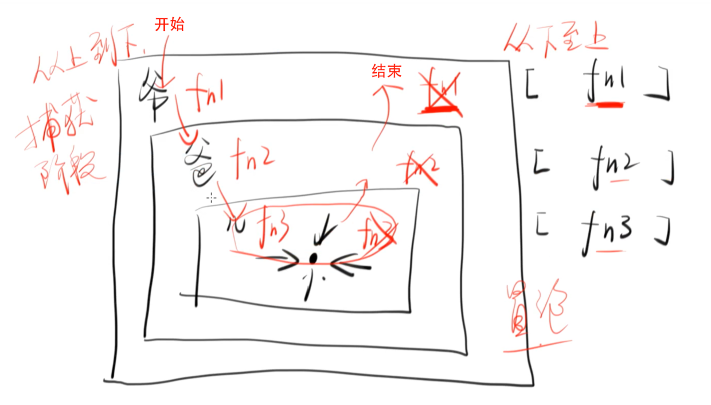

先不说【捕捉，冒泡】是什么东西（概念）

##### 首先我们来看[一段代码](http://js.jirengu.com/quruy/2/edit?html,js,console,output)
``` html
// html
<div id="grand">
  爷爷
  <div id="father">
    爸爸
    <div id="son">
      儿子
    </div>
  </div>
</div>
```
``` js
// js
grand.addEventListener('click', function f1() {
  console.log('fn1')
})

father.addEventListener('click', function f2() {
  console.log('fn2')
})

son.addEventListener('click', function f3() {
  console.log('fn3')
})
```
##### 当我们鼠标点击儿子时，触发的事件顺序究竟是什么样的呢？
1、
```
fn3
fn2
fn1
```
2、
```
fn1
fn2
fn3
```

##### 一试便知，是第一种 `fn3=>fn2=>fn1` 。

通过查阅 [MDN](https://developer.mozilla.org/zh-CN/docs/Web/API/EventTarget/addEventListener) ，我们可以使用第三个参数，默认为 `falsy`

> 1、所以当我们[如下写法](http://js.jirengu.com/quruy/2/edit?html,js,console,output)时：
> ```
> grand.addEventListener('click', function f1() {
>   console.log('fn1')
> })
> 
> father.addEventListener('click', function f2() {
>   console.log('fn2')
> })
> 
> son.addEventListener('click', function f3() {
>   console.log('fn3')
> })
> ```
> 结果为 `fn3=>fn2=>fn1`

> 2、所以当我们[如下写法](http://js.jirengu.com/depoj/3/edit?html,js,console,output)时：
> ```
> grand.addEventListener('click', function f1() {
>   console.log('fn1')
> }, true)
> 
> father.addEventListener('click', function f2() {
>   console.log('fn2')
> }, true)
> 
> son.addEventListener('click', function f3() {
>   console.log('fn3')
> }, true)
> ```
> 结果为 `fn1=>fn2=>fn3`

#### 接下来我们就可以来说说*【捕获，冒泡】*
#### 为了更清楚，我们可以用一张图来表示



> 左边就是参数为 `true` 的状态（捕获阶段）， 右边就是 `false` 的状态（冒泡阶段），
所以就有了**先捕获在冒泡**这一说法

##### 对着这张图我们再来看[一段代码](http://js.jirengu.com/hunur/1/edit?html,js,console,output)（虽然很无聊，因为没人会这么写）
```
grand.addEventListener('click', function f1() {
  console.log('fn1')
}, true)

father.addEventListener('click', function f2() {
  console.log('fn2')
})

son.addEventListener('click', function f3() {
  console.log('fn3')
})
```

答案也很显然易见，为 `true` 的先执行，也就是 `fn1=>fn3=>fn2`

### 到此，【捕获、冒泡就应该已经讲完了】

## 但是有一个特例！！！
##### 就是[如下的情况](http://js.jirengu.com/gedaj/1/edit?html,js,console,output)时，当【捕获、冒泡】在同一个元素上时（也虽然很无聊）
```
son.addEventListener('click', function f3() {
  console.log('fn3冒泡')
})
son.addEventListener('click', function f3() {
  console.log('fn3捕获')
}, true)
```
> 按照上图或者理论（先捕获再冒泡）说法，应该是 `fn3捕获=>fn3冒泡`
但是实际情况却是
当【捕获、冒泡】在同一个元素上时，那就是 **按照书写顺序来，谁先写，就先执行**
上述代码执行结果就应该是 `fn3冒泡=>fn3捕获`

end
