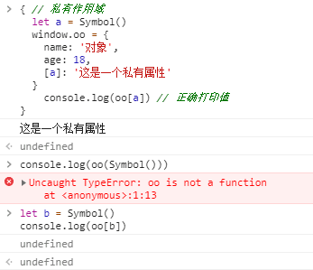
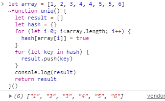
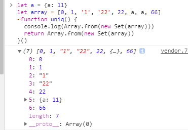
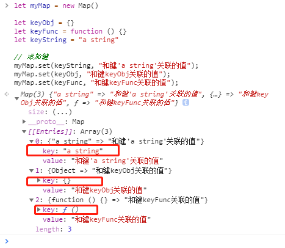

*   [Symbol 类型](https://developer.mozilla.org/zh-CN/docs/Web/JavaScript/Reference/Global_Objects/Symbol "null")*（基本）*
*   [Set 类型](https://developer.mozilla.org/zh-CN/docs/Web/JavaScript/Reference/Global_Objects/Set "null")*（复杂）*
*   [Map 类型](https://developer.mozilla.org/zh-CN/docs/Web/JavaScript/Reference/Global_Objects/Map "null")（复杂）
*   [WeakSet 类型](https://developer.mozilla.org/zh-CN/docs/Web/JavaScript/Reference/Global_Objects/WeakSet "null")*（复杂）*
*   [WeakMap 类型](https://developer.mozilla.org/zh-CN/docs/Web/JavaScript/Reference/Global_Objects/WeakMap "null")*（复杂）*
*   [TypedArray 类型](https://developer.mozilla.org/zh-CN/docs/Web/JavaScript/Reference/Global_Objects/TypedArray "null")*（复杂）*

我们再来看一看 `es6` 之前有哪些数据类型，

基本类型：
* `string`
* `null`
* `undefined`
* `number`
* `boolean`

复杂类型：
* `object`

由于新出的类型在平常工作中基本用不到，所以具体介绍还是直接看 `MDN` 的专业解释把，此文主要讲解面试经常遇到的一些问题....

#### Q1：怎么让一个对象具有一个私有属性？（Symbol有什么用？）
Answer：用 `Symbol` 作为对象的 `key` 即可
```
{ // 私有作用域
  let a = Symbol()
  window.oo = {
    name: '对象',
    age: 18,
    [a]: '这是一个私有属性'
  }
  console.log(oo[a]) // 这是一个私有属性
}
// 不能再作用域外打印...
```
此时对象 `oo` 就有一个私有属性，该属性在作用域外就无法正确打印。



#### Q2：怎么快速去重一个数组？
Answer：用 `Set` 加 `Array.form()`
这是一道很经典的面试题，在此之前先讲讲 `es6` 之前的去重方法：
```
let array = [1, 2, 3, 4, 4, 5, 5, 6]
~function uniq() {
  let result = []
  let hash = {}
  for (let i=0; i<array.length; i++) {
    hash[array[i]] = true
  }
  for (let key in hash) {
    result.push(key)
  }
  console.log(result)
  return result
}()
```



但是该方法有巨大的弊端，去重数组中不能有对象，而且该方法返回的结果中都是字符串，所以无法对这样的数组进行去重。

当我们使用 `Set` 时
```
let a = {a: 11}
let array = [0, 1, '1', '22', 22, a, a, 66]
~function uniq() {
  return Array.from(new Set(array)) // 装比写法 [... new Set(array)]
}()
```



甚至连对象的引用也能去重，很简略的方法。
#### Q3：Map有啥用？
Answer：`map` 更像是对象的拓展，他的 `key` 可以是任意类型，不再像之前的对象 `key` 只能是字符串，也就是这个特性，我们可以去优化之前的去重，但是也没有必要，因为已经有 `set` 了。
🌰
```
let myMap = new Map()
 
let keyObj = {}
let keyFunc = function () {}
let keyString = "a string"
 
// 添加键
myMap.set(keyString, "和键'a string'关联的值");
myMap.set(keyObj, "和键keyObj关联的值");
myMap.set(keyFunc, "和键keyFunc关联的值");
```



#### Q4：WeakMap 和 Map 的区别？
Answer：
1. `WeakMap` 区别就是对 `key` 的引用是弱引用
2. `WeakMap` 的 `key` 只能是对象

需要了解的就是弱引用是啥了：
文章：[ES2015 WeakMap的学习和使用](https://zhuanlan.zhihu.com/p/25454328 "null")

#### Q5：WeakSet 和 Set 的区别？
Answer：同上
#### Q6：TypedArray 有什么用？
Answer：这个类型用的途径更少了，主要用于二进制文件（音频，文件，视频，图片...）的处理，一般用不到，除非你自己开发轮子。
