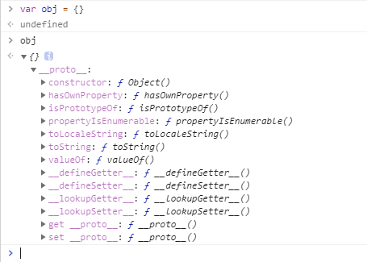
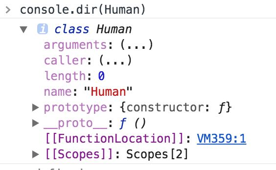
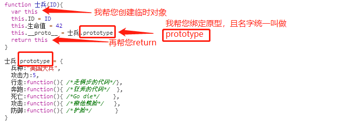

此文先留白思考，哈哈哈哈。

----------------------

##### 时隔两个月，终于更新啦~~~~~~ `// 2018.11.30`
因为 `new` 牵扯的知识点太多，但又都是必要的。。。
篇幅较长，细心慢看=。=

------------------------------------------
------ 正文开始 ------。

**前言：**说new之前，我们首先得了解`js`的的另一个知识点。
>`__proto__` 和 `prototype`

由于 `es6` 新出了 `class` 关键字以后小白们对于 `js` 原型的概念更加模糊了。

但是对于 `js` 老鸟来说想要真正理解 `js` 这门语言对于原型的理解必须彻底。

js的最大区别其他语言特性之一就是***原型*** (现在还不掌握 `__proto__` 和 `prototype` ，那还等到什么时候呢？)

**让我们先来看看 `__proto__` 和 `prototype` 到底是个啥？**

1. 你的 JS 代码还没运行的时候，JS 环境里已经有一个 window 对象了
2. window 对象有一个 Object 属性，window.Object 是一个函数对象
3. window.Object 这个函数对象有一个重要属性是 prototype，干什么用的等会说
4. window.Object.prototype 里面有这么几个属性 toString（函数）、valueOf（函数）

好，目前先知道这些就够了。然后我们写一句代码
```
var obj = {}
obj.toString()
```
这句代码做了啥？为什么 obj 有 toString() 属性？
<br>
这句话大概是让 obj 变量指向一个空对象，这个空对象有个 __proto__ 属性指向 window.Object.prototype。

这样你在调用 obj.toString() 的时候，obj 本身没有 toString，就去 obj.__proro__ 上面去找 toString。

所以你调用 obj.toString 的时候，实际上调用的是 window.Object.prototype.toString

那么 window.Object.prototype.toString 是怎么获取 obj 的内容的呢？

那是因为 obj.toString() 等价于 obj.toString.call(obj)

同时 obj.toString.call(obj) 等价于 window.Object.prototype.toString.call(obj)这句话把 obj 传给 toString 了。



// 再看复杂一点的

我们写一句代码
```
var arr = []
arr.push(1) // [1]
```
请问这两句话做了什么？
<br>
看红色部分，`var arr = []` 大概会让 `arr` 指向一个空对象，然后 `arr.__proto__` 指向 `window.Array.prototype`。（其实 `arr` 有一个 `length:0`，不过这里就忽略吧）

这样你在调用 `arr.push` 的时候，`arr` 自身没有 `push` 属性，就去 `arr.__proto__` 上找 `push`

因此 `arr.push` 实际上是 `window.Array.prototype.push`

`arr.push(1)` 等价与 `arr.push.call(arr,1)`

`arr.push.call(arr,1)` 等价于 `window.Array.prototype.push.call(arr, 1)`

// 再再复杂一点

`arr.valueOf()` 做了什么?

`arr` 自身没有 `valueOf`，于是去 `arr.__proto__` 上找

`arr.__proto__` 只有 `pop`、`push` 也没有 `valueOf`，于是去 `arr.__proto__.__proto__` 上找

`arr.__proto__.__proto__` 就是 `window.Object.prototype`

所以 `arr.valueOf` 其实就是 `window.Object.prototype.valueOf`

`arr.valueOf()` 等价于 `arr.valueOf.call(arr)`

`arr.valueOf.call(arr)` 等价于 `window.Object.prototype.valueOf.call(arr)`

看，JavaScript 其实很优美很简单。

只是你想复杂了而已：

`prototype` 指向一块内存，这个内存里面有共用属性

`__proto__` 指向同一块内存

`prototype` 和 `__proto__` 的不同点在于

`prototype` 是构造函数的属性，而 `__proto__` 是对象的属性

难点在于……构造函数也是对象！

如果没有 `prototype`，那么共用属性就没有立足之地

如果没有 `__proto__`，那么一个对象就不知道自己的共用属性有哪些。

// 反证法

假设我们把 __proto__ 去掉，那么
```
var obj = {}
obj.toString() // 报错，没有 toString 方法
```
所以你只能这样声明一个对象咯：
```
var obj = {
  toString: window.Object.prototype.toString,
  valueOf: window.Object.ptototype.valueOf
}
obj.toString() // '[object Object]'
```

知道 __proto__ 帮你省多少代码了吗？

假设我们删掉 prototype，包括 window.Object.prototype 和 window.Array.prototype。

那么 window.Object.prototype.toString 也一并被删除了。

然后我们基本就没法写代码了……
```
var obj = {}
obj.toString() // toString 不存在，因为 toString 没有定义过啊
```

prototype 的意义就是把共有属性预先定义好，给之后的对象用。
<br>
讲到这里，顺带再提一提另外一个相关的知识点。

比如很多人不懂什么是伪数组，
1. 很简单：如果一个数组的 `__proto__` 直接或间接指向 `Array.prototye`（用到了数组的共用属性），那么就是真数组
2. 如果一个数组的 `__proto__` 没有直接或间接指向 `Array.prototye`，那么就是伪数组
```
var realArr = {0: 'a', 1:'b', length: 2}
realArr.__proto__ = Array.prototype
// 这就是真数组（并不完全是）
// 基本等价于 realArr = ['a', 'b']
realArr.push !== undefined // true

var fakeArr = {0: 'a', 1:'b', length: 2}
// 这就是伪数组
realArr.push === undefined // true
```
因为如此，所以在es6 `Array.from(xxx)` 的之前，前端才会衍生出 `Array.prototype.slice.call(xxx)`(如果不理解这里的call啥意思，回退文章列表查阅关于this篇幅) 这种蹩脚的伪数组转数组方法。


>ps：看到这里，先停下自己想想吧，没理解的话，也就没有必要再往下看了~

<br>
<br>
休息一下，继续往下看~
<br>
<br>
<br>
<br>
<br>


##### 这是一个知乎上的问题
>Question：「为什么明知 JS 的 class 是假的，程序员还不厌其烦地实现 class，而不使用原型」
Answer： [知乎链接](https://www.zhihu.com/question/270890846)

结论：
>「所有」理解 prototype 的 JS 程序员都能轻松理解 JS 里的 class；
反过来，理解 class 的 JS 程序员却「有很多」都理解不了 prototype。

这就是为什么早年间很大 JS 大神不得不用 prototype 去模拟一个蹩脚的 klass 给新人用。

我没有把 klass 拼错，因为 class 是保留字，所以大神只能用 klass 来「代替」class。

虽然我认为原型是 JS 的基础知识，但是根据实际情况，原型居然变成了 JS 的高级知识，很多新人直接在入门的时候放弃学习原型，而去学 class。

所以，prototype 绝对能让你有智商优越感 :)
<br>
好了，开始正经讨论问题。
1. class 的问题
   1.1 - class 功能残缺
   1.2 - class 使你无法理解 JS 的本质
   1.3 - class 不能带来额外的好处，如类型安全
2. prototype 的问题
   2.1 - ES 6 之前大家不想了解 prototype
   2.2 - ES 6 之前 prototype 操作不方便


***// 第一个问题，功能缺失。***
我是一个实用主义者，如果 class 比 prototype 好用，我绝对会总是使用 class。
但是目前情况是：
- JS 里 class 的功能还不如 prototype
- JS 里 class 的功能比 Java 里的 class 更是差了十万八千里

##### Answer1.1
JS 里 class 的功能还不如 prototype

以 let frank = new Human() 为例。如果你要给 Human 加一个 x 属性，怎么加？

对于使用原型的人来说，Human 不就是一个函数对象吗，直接加就是了，何必多此一问：
```
Human.x = 'xxx'
```
完

对于使用 class 的人来说，经典 OO 理论会使他倾向与把 Human 看做一个 class，所以应该使用这样的语法
```
class Human{
  static x = 1; // 可惜目前会报语法错误
}
```
然而，这个语法，还没有纳入 ES 标准，所以目前在 JS 里用 class 连个静态字段都定义不了，真可惜。

有些人可能会说，那我混用 class 和原型呗：
```
class Human{
}
Human.x = 1
```
如果这样写的话 Human 还是类的话，那我就不说什么了。

你问问 Java 程序员能不能理解这样不伦不类的 class。

总之，目前你不可能把 JS 的 class 当成真正的类，你还是得把 Human 看成一个函数对象才行。

有些人可能还会说，我等 class 语法升级不就行了。你都能升级语法了，那我怎么还能说得过你呢，对吧，只要我说 class 哪里有问题你都可以用升级解决。

所以我只讨论目前的 ES 语法。目前使用 class 前你还是需要完全理解 prototype。

##### Answer1.2
JS 里 class 的功能比 Java 里的 class 更是差了十万八千里请用 JS 的 class 写出一个抽象类。
对不起，目前 class 做不到，等升级语法吧。


JS 的 class 如何实现 private、public 和 protected。

对不起，目前 class 做不到，等升级语法吧。
<br>

可千万别说你可以用其他方法模拟，模拟出个阉割版有意思吗？
<br>

有些人可能会说，class 实现不了我认，你 prototype 不也实现不了吗？大家都实现不了，凭什么说我有问题。
这就是一个自相矛盾的地方了，prototype 为什么要去模拟 class 的特性？

在 prototype 体系里，根本就没有类，更遑论抽象类和 private 关键字了。

没有类（class）！

怎么有些人老想着用 JS 模拟 class 呢？
不解决这个问题，用 JS 就会总觉得别扭。

>想一想：为什么你非要在一个原型语言里，使用 class 思维来思考问题。

因为你先入为主地觉得 class 比 prototype 好啊……如果你还没意识自己的问题，恐怕我是真的扳不过来了。

再说一遍：不要把 JS 当做经典面向对象语言（比如 Java）使用。

如果你只学 JS 里的 class 不学 prototype，恐怕最终的后果就是既没有学会经典面向对象，又没有学会原型。
方言称之为半吊子，普通话称之为半壶水。

所以 JS 的 class 到底是个啥？

>class 是 prototype 的语法糖而已。

岂有教人只学习语法糖，不学习真正特性的道理？

***// 第二个问题***

如果你说我们不能对 JS 这门动态语言要求太多，class 能部分实现 prototype 的功能，够用就行了，没必要再去学习 prototype 了。

那我依然不同意，因为 class 还有一个更严重的问题：
>「只会 class」将使你无法系统理解 JS。

依然以最简单的代码为例
```
class Human{
  sayHi(){
    console.log('hi')
  }
}
```
面向对象的解释：Human 类有一个成员方法 sayHi。

只会 class 的同学现在请回答一个问题
>Human 的类型是什么？

答案是 'object'（对象），同时 Human 也是一个函数。class 是一个函数，你不觉得奇怪吗？

再问一个问题，console.dir(Human) 你会看到它有以下属性：



>请问 Human 为什么有 prototype 属性？
为什么 Human.prototype 有一个 sayHi 属性？

看吧，你始终绕不开原型…… JS 的 class 总会把你引向原型。

我实在是无法理解只会 class 的 JS 开发者要如何理解 JS：

1. 你需要无视每个对象的 __proto__ 属性
2. 你需要无视每个类的 prototype 属性

class 的这个问题才是我反对只学 class 的最关键原因。

无论 JS 的 class 语法如何升级，不管是 ES 6 还是 ES 7、ES 8、ES 9、ES 10、ES 11，都绕不开 prototype。永远都绕不开。因为这是 JS 里对象的本质。

如果绕不开 prototype，你还有什么理由不学 prototype？还有什么理由不好好地、深入地学习 prototype？有些人可能会说，那我先学会 prototype，但是不用 prototype 只用 class 行不行呢？当然行。

但你必须先学会 prototype 呀同学，然后才能理解 class 呀！


##### Answer1.3
class 的第三个问题是，class 带来的好处并不多，除了作为糖能让你少写一些代码外，并没有多少额外的好处。用语法糖我不反对，但是如果只用语法糖不学语法糖背后的原理，那我就反对。

有观点认为 class 能使 JS 更加「类型安全」。

持这种观点的人可能对 JS 有误解，一门「没有编译阶段」的「动态」「弱类型」语言怎么可能类型安全啊……JS 任何对象随时都可以被改得面目全非，用了 class 也无济于事。

想要类型安全去用 TypeScript 吧，class 并不能拯救 JS。

而且类型安全属于另一个问题，可以另开帖子讨论。

另外不要以为 TypeScript 里面的 class 跟 JS 里的 class 一样，虽然 TypeScript 是 JS 的超集，但是有编译阶段的 class 和没编译阶段的 class 就是质的区别。

这就是编译的威力。不是 class 的威力

##### prototype 的问题

class 这么多问题，难道 prototype 就是完美的吗？
如果 prototype 那么好，这么会有这么多人喜欢 class 呢？
<br>
JS 的原型比 JS 的 class 好，没说 JS 语言（ES 6 之前）本身有多好。

JS 语言本身（在 ES 6 之前）还是很烂的，为此道格拉斯还专门写了 JS the good parts 这本书来把 JS 为数不多的优点给列出来。

JS 多烂我以后再讨论。但是 JS 的原型绝对是好东西。
正如 JS 之父所说：
>它的优秀之处并非原创，它的原创之处并不优秀。——JS 之父引用别人的话描述 JS

实际上 JS 原创之处全都很垃圾。这个原型就不是 JS 原创的，而且原型很优秀。

所以 prototype 的第一个问题是，它隐藏在 JS 的一堆烂特性中，无法被人发现。

那么第二个问题是什么？

第二个问题是在 ES 6 之前，人们无法很方便地对原型进行操作。

ES 6 之前，你要改变一个对象的原型要怎么做？

你可能会以为这样就可以改变原型：
```
xxx.__proto__ = anotherPrototype
```
但是这个代码很可能报错，因为 __proto__ 到目前为止，都是不推荐使用的特性。

ES 6 出了 Object.create 和 Object.setPrototypeOf 才让开发者能安心操作原型。


那么正确的代码是什么呢？
***敲黑板,敲黑板,敲黑板，重点！(方便理解下面的new)***
```
var emptyFn = function(){}
emptyFn.prototype = anotherPrototype
xxx = new emptyFn()
```
以上三行代码是 JS 程序不懈努力才发现的实现 `xxx.__proto__ = anotherPrototype` 的方法。

现在估计你能理解了「为什么在 ES 6 之前，JS 程序员不喜欢 prototype」，因为理解难度实在有点大啊：
1. 首先你要耐心学会 JS 的各种烂语法，然后走到 prototype 面前
2. 为了兼容性，你需要用特别奇怪的代码来操作 prototype

但是 ES 6 来了之后，这两个问题都解决了呀：
1. JS 的各种烂语法都有对应的修正，如 var 被 let 代替
2. 操作 prototype 很简单了，用 Object.create 就好所以，现在，你应该去学 prototype 了。

学会了 prototype，再去学 class 就跟吃糖一样简单。

#### 在理解了 `__proto__` 和 `prototype` 以后，我们现在再来看看 `new`

看了那么久的文字，那就从一个图文并茂的栗子开始看吧 **^ _ ^**

想象我们在制作一个策略类战争游戏，玩家可以操作一堆士兵攻击敌方。

我们着重来研究一下这个游戏里面的「制造士兵」环节。

一个士兵的在计算机里就是一堆属性，如下图：


我们只需要这样就可以制造一个士兵：
```
var 士兵 = {
  ID: 1, // 用于区分每个士兵
  兵种:"美国大兵",
  攻击力:5,
  生命值:42, 
  行走:function(){ /*走俩步的代码*/},
  奔跑:function(){ /*狂奔的代码*/  },
  死亡:function(){ /*Go die*/    },
  攻击:function(){ /*糊他熊脸*/   },
  防御:function(){ /*护脸*/       }
}

兵营.制造(士兵)
```
**制造一百个士兵**
如果需要制造 100 个士兵怎么办呢？

循环 100 次吧：
```
var 士兵们 = []
var 士兵
for(var i=0; i<100; i++){
  士兵 = {
    ID: i, // ID 不能重复
    兵种:"美国大兵",
    攻击力:5,
    生命值:42, 
    行走:function(){ /*走俩步的代码*/}，
    奔跑:function(){ /*狂奔的代码*/  },
    死亡:function(){ /*Go die*/    },
    攻击:function(){ /*糊他熊脸*/   },
    防御:function(){ /*护脸*/       }
  }
  士兵们.push(士兵)
}

兵营.批量制造(士兵们)
```
哎呀好简单。

**质疑**
上面的代码存在一个问题：浪费了很多内存。

1. 行走、奔跑、死亡、攻击、防御这五个动作对于每个士兵其实是一样的，只需要各自引用同一个函数就可以了，没必要重复创建 100 个行走、100个奔跑……
2. 这些士兵的兵种和攻击力都是一样的，没必要创建 100 次。
3. 只有 ID 和生命值需要创建 100 次，因为每个士兵有自己的 ID 和生命值。

**改进**
如果用上文的原型链来做呢~
用原型链可以解决重复创建的问题：我们先创建一个「士兵原型」，然后让「士兵」的 __proto__ 指向「士兵原型」
```
var 士兵原型 = {
  兵种:"美国大兵",
  攻击力:5,
  行走:function(){ /*走俩步的代码*/}，
  奔跑:function(){ /*狂奔的代码*/  },
  死亡:function(){ /*Go die*/    },
  攻击:function(){ /*糊他熊脸*/   },
  防御:function(){ /*护脸*/       }
}
var 士兵们 = []
var 士兵
for(var i=0; i<100; i++){
  士兵 = {
    ID: i, // ID 不能重复
    生命值:42
  }

  /*实际工作中不要这样写，因为 __proto__ 不是标准属性*/
  士兵.__proto__ = 士兵原型 

  士兵们.push(士兵)
}

兵营.批量制造(士兵们)
```
**优雅？**
有人指出创建一个士兵的代码分散在两个地方很不优雅，于是我们用一个函数把这两部分联系起来：
```
function 士兵(ID){
  var 临时对象 = {}

  临时对象.__proto__ = 士兵.原型

  临时对象.ID = ID
  临时对象.生命值 = 42
  
  return 临时对象
}

士兵.原型 = {
  兵种:"美国大兵",
  攻击力:5,
  行走:function(){ /*走俩步的代码*/}，
  奔跑:function(){ /*狂奔的代码*/  },
  死亡:function(){ /*Go die*/    },
  攻击:function(){ /*糊他熊脸*/   },
  防御:function(){ /*护脸*/       }
}

// 保存为文件：士兵.js
```
然后就可以愉快地引用「士兵」来创建士兵了：
```
var 士兵们 = []
for(var i=0; i<100; i++){
  士兵们.push(士兵(i))
}

兵营.批量制造(士兵们)
```
but~~~~
#### 首先遇到的问题就是我们无法在实际工作中使用 `__proto__`

>所以JS 之父创建了 `new` 关键字，可以让我们少写三行代码
　　　　　　　　　　　　　　　　　　　　　　　　　　　　　　　　　　　　　------来自JS 之父的关怀



只要你在士兵前面使用 new 关键字，那么可以少做四件事情：

1. 不用创建临时对象，因为 new 会帮你做（你使用「this」就可以访问到临时对象）；
2. 不用绑定原型，因为 new 会帮你做（new 为了知道原型在哪，所以指定原型的名字为 prototype）；
3. 不用 return 临时对象，因为 new 会帮你做；
4. 不要给原型想名字了，因为 new 指定名字为 prototype。

**这一次我们用 new 来写**
```
function 士兵(ID){
  this.ID = ID
  this.生命值 = 42
}

士兵.prototype = {
  兵种:"美国大兵",
  攻击力:5,
  行走:function(){ /*走俩步的代码*/},
  奔跑:function(){ /*狂奔的代码*/  },
  死亡:function(){ /*Go die*/    },
  攻击:function(){ /*糊他熊脸*/   },
  防御:function(){ /*护脸*/       }
}

// 保存为文件：士兵.js
```
然后是创建士兵（加了一个 new 关键字）：
```
var 士兵们 = []
for(var i=0; i<100; i++){
  士兵们.push(new 士兵(i))
}

兵营.批量制造(士兵们)
```
>new 的作用，就是省那么几行代码。（也就是所谓的语法糖）

哦对，这其中还有一个叫做 `constructor` 的属性

new 操作为了记录「临时对象是由哪个函数创建的」，所以预先给「士兵.prototype」加了一个 constructor 属性：
```
士兵.prototype = {
  constructor: 士兵
}
```
如果你重新对「士兵.prototype」赋值，那么这个 constructor 属性就没了，所以你应该这么写：
```
士兵.prototype = {
  constructor: xx士兵,
  兵种:"美国大兵",
  攻击力:5,
  行走:function(){ /*走俩步的代码*/},
  奔跑:function(){ /*狂奔的代码*/  },
  死亡:function(){ /*Go die*/    },
  攻击:function(){ /*糊他熊脸*/   },
  防御:function(){ /*护脸*/       }
}
```
<br>
end
本文完~

---------------------
最后在更新一道检测题，看你是否真的已经掌握 `new`(此题有坑)

要求不使用 class，完成如下需求：

1. 写出一个构造函数 Animal
   i.输入为空
   ii.输出为一个新对象，该对象的共有属性为 `{行动: function(){}}` ，没有自有属性
2. 再写出一个构造函数 Human
   i.Human 继承 Animal
   ii.输入为一个对象，如 `{name: 'xxx', birthday: '2000-10-10'}`
   iii.输出为一个新对象，该对象自有的属性有 name 和 birthday，共有的属性有物种（人类）、行动和使用工具
3. 在写出一个构造函数 Asian
   i.Asian 继承 Human
   ii.输入为一个对象，如 `{city: '浙江', name: 'xxx', birthday: '2000-10-10' }`
   iii.输出为一个新对象，改对象自有的属性有 name city 和 bitrhday，共有的属性有物种、行动和使用工具和肤色
   既
>最后一个新对象是 Asian 构造出来的
Asian 继承 Human，Human 继承 Animal

注意，不要使用 class 关键字，请使用原型链（答案可以写在评论区哦~）


