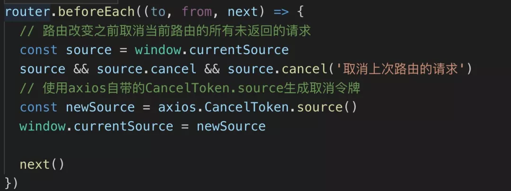
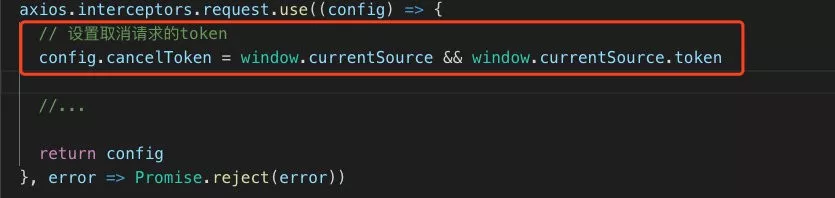
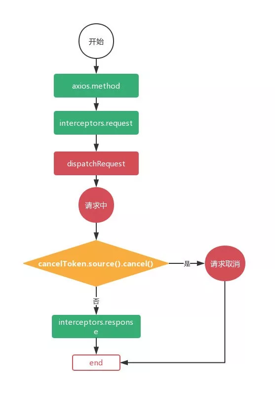

## axios文档里介绍的取消axios请求有以下两种方式：
```
// 第一种：使用 CancelToken
const { CancelToken, isCanCel } = axios;
const source = CancelToken.source();

axios.get('/user/12345', {
  cancelToken: source.token
}).catch(thrown => {
  if (isCancel(thrown)) {
      // 获取 取消请求 的相关信息
    console.log('Request canceled', thrown.message);
  } else {
    // 处理其他异常
  }
});

axios.post('/user/12345', {
  name: 'new name'
}, {
  cancelToken: source.token
})

// 取消请求。
source.cancel('Operation canceled by the user.');

// 第二种：还可以通过传递一个 executor 函数到 CancelToken 的构造函数来创建 cancel token：
const CancelToken = axios.CancelToken;
let cancel;

axios.get('/user/12345', {
  cancelToken: new CancelToken(function executor(c) {
    // executor 函数接收一个 cancel 函数作为参数
    cancel = c;
  })
});

// 取消请求
cancel();
```

## 举🌰：切换路由时，取消上个路由的请求。

其实我们的解决方式就是同一个路由下的请求公用一个canceltoken，虽然多个请求会生成多个promise链，但是在adapterPromise局部的cancelToken.promise却是同一个，这样在执行axios.cancelToken.source().cancel方法时候就会作用于全部promise链，一旦cancel一执行，所有未完成的请求都会取消，相对应的promise链都会变为rejected。

初始入口文件中通过axios生成cancelToken:



axios的拦截器的request配置中添加参数cancelToken



## 一个请求在axios的工作流程，像一个管道一样：



