## 1. `:is()` 和 `:where()`

``` CSS
:is(.header, .main) p {
  color: red;
}
:where(.header, .main) p {
  color: red;
}
```

其实这两个选择器等同于：

``` CSS
.header p, .main p {
  color: red;
}
.header p, .main p {
  color: red;
}
```

他们唯一不同之处，就是选择器**权重**不同。等同于以：

``` CSS
/* :is */
.header p, .main p {
  color: red;
}
/* :where */
p {
  color: red;
}
```
🌰：一般可以用来简写一些选择器
``` CSS
.div1 p, .div2 p .div3 p {}
/* 简写 */
:is(.div1, .div2, .div3) p {}
```

## 2. `:not()` 和 `:has()`

🌰：有时候可以更有语义化一点表示下图需求：

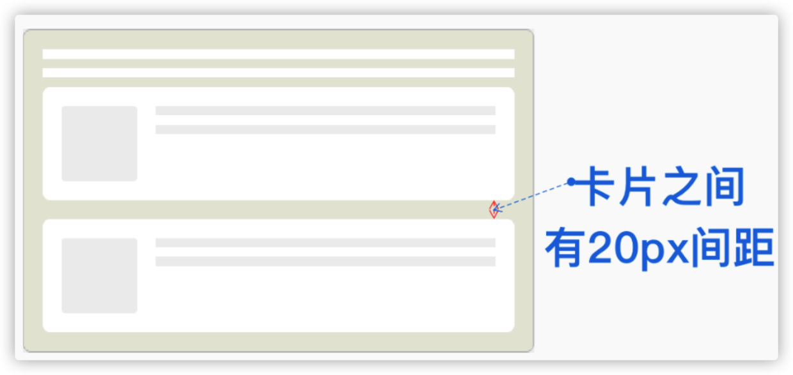

在没有 `:not()` 选择器的时候，你可能会想到下面这样的方式

``` CSS
.card + .card { /* 没用过的看不懂 */
  margin-top: 20px;
}	

/* 或 */

.card {
  margin-bottom: 20px;
}
.card:last-child { /* 需要拆成了两行来写 */
  margin-bottom: 0;
}
```

如果换成 `:not()` 选择器，可以这要来实现：

``` CSS
.card:not(:last-child) {
  margin-bottom: 20px
}
```

虽然 CSS 选择器已经非常强大了，但一直以来，在 CSS 中没有从子元素选到父元素的样的选择器（父选择器）：

即将到来的 `:has()` 选择器它可以用来选择父级元素

``` HTML
<section> <!-- section 边框颜色是 blue --> 
  <h1>H1 Level Title</h1>
</section>  
<section> <!-- section 边框颜色是 red --> 
  <h2>H2 Level Title</h2>
</section>  
```
``` CSS
section:has(h1) {
  border-color: blue;
}
section:has(h2) {
  border-color: red;
}
```

🌰：可能根据子元素的变化，改变父元素的样式，而不必再给父元素添加额外的 class

## 3. `:empty` 和 `:blank`

🌰：有时候数据为空时，如下图这样：

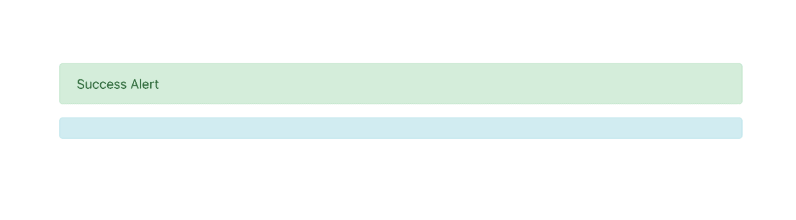

此时我们还要额外隐藏容器，要是有了表示空状态的伪类选择器就可以直接这么写

```
section:empty {
  display: none; /* or others */
}
```

但是 `:empty` 只能选中没有子元素的元素。子元素只可以是元素节点或文本（包括空格）。注释或处理指令都不会产生影响。

``` HTML
<!-- 空元素 -->
<div class="error"></div>
<div class="error"><!-- 注释 --></div>
<div class="error pseudo-elements(伪元素)"></div> 

<!-- 非空元素 -->
<div class="error"> </div> <!-- 中间有一个空格符 -->
<div class="error">
</div> <!-- 断行 -->
<div class="error">
  <!-- 注释 -->
    <!-- ... -->
  <!-- 注释 -->
</div> <!-- 注释断行排列 -->
<div class="error"><span></span></div>
```

## 4. `mask` 和 `clip-path`

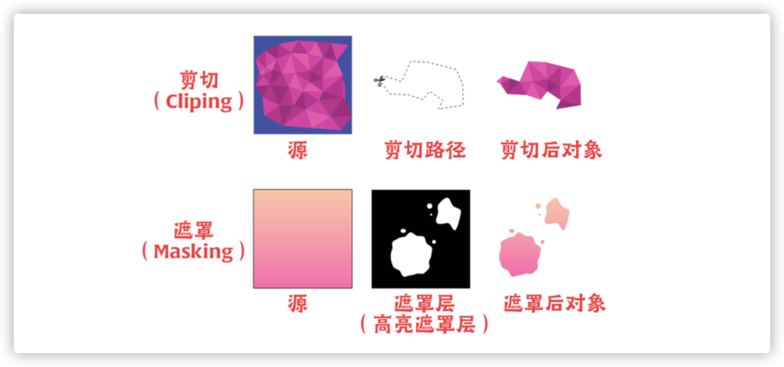

## 5. `mix-blend-mode`

```
.wrapper {
    position: relative;
}
:is(.wrapper) svg, img {
    position: absolute;
    top: 0;
    left: 0;
}
.wrapper svg {
    fill: red;
  mix-blend-mode: multiply;
  z-index: 2;
}

<section class="wrapper">
        <svg id="js-couch" class="couch__overlay" xmlns="http://www.w3.org/2000/svg" xmlns:xlink="http://www.w3.org/1999/xlink" preserveAspectRatio="none" width="1000" height="394"> 
            <defs> 
              <path d="M996.35 77.55q-1.85-1.95-8.65-3.75l-62.4-17.1q-9.3-2.75-12.15-2.5-1.8.15-2.85.45l-.75.3q2.25-16.3 3.75-22.05 1.15-4.4 1.4-10.8.2-6.6-.7-10.85-1.25-5.65-3.1-7.8-2.95-3.35-9.65-2.7-5.95.6-39.3 1.7-38.3 1.25-39.45 1.3-10.25.5-126.75.5-5.05 0-54.2 1.3-45.8 1.25-54.05.95-19.45-.45-30.4-.7-20.2-.55-23.1-1.3-22.3-5.85-26.5 1.25-2.65 4.55-3.85 7.9-.6 1.7-.7 2.5-.65-2.2-2.05-4.55-2.75-4.65-6.45-5.2-3.85-.55-13.65-.4-7.4.1-12 .4-.4.05-18.7.9-16.55.8-19.15 1.1-3.4.4-14.6 1.1-11.3.75-13.05.65h-9.8q-8.65-.05-11.45-.4-2.85-.35-9.25-.6-6.7-.15-8.5-.25-2.7-.1-27.75-.1-25.1 0-29.6.1-92.35 1.15-99 1.65-5.15.4-20 0-15.3-.4-24.4-1.25-6.75-.6-21-1.55-12.95-.9-14.85-1.1-6.45-1.05-11.05-1.5-8.7-.85-12.85.5-5.45 1.75-8.1 4.65-3.2 3.4-2.9 8.6.25 4.65 2.1 11.8 1 3.8 2.55 9.1 1 3.85 2.35 10.1-.1 1-1.5 1-1.75 0-7.7.85-7.1 1-9.8 2.05-2.4.9-23 4.75-21.2 3.9-22.05 4.15-8.2 1.85-15.05 3.35Q7.4 69.1 5.65 70.3 2.5 72.45 2 73.1.6 75 .75 79.2q.15 4.15 1.3 12.75.9 6.85 1.45 10 .5 2.75 8.55 54 6.65 42.15 7.35 46.85 1.15 7.65 4.9 28.55 4.55 25.2 6.35 31.2 2.45 8.15 3.8 11.75 1.85 4.9 3.2 5.75 1.25.8 6.85.65 2.75-.05 5.3-.25l23.85.35q.1 0 1 .95t2 .95q1.9 0 3.4-1.4l23.1-.25 43.65.4q135.05 2.15 137.9 1.9 1.25-.1 72.9.5 72.45.65 76.85.45 8.1-.35 64 .4 143.35.95 146 1.1.55.05 75.3.3 74.7.3 79.8.6 8.65.5 68.25-.35l51.75.5 1.6.4q1.95.35 3.8.05 1.45-.25 3.5-.2 1.9 0 3.35-.3 2.1-.45 8.25-.8 6.25-.3 8.75-.05 1.7.2 8 1 5.75.3 7.4-1.75 1.75-2.2 4.95-10.85 2.8-7.55 4.05-12.4.65-2.5 3.6-17.2 2.75-13.75 3.15-14.8.45-1.25 4.45-22.85 4.05-22.4 4.4-24.4.3-1.45 3.75-25.2 3.35-23.2 4-26.3 1.15-5.5 2.35-18.8 1.4-15.7.8-23.7-.6-8.35-3.35-11.15z" id="a" /> 
              </defs> 
            <use xlink:href="#a"/> 
          </svg>
          
    </section>
```
在线：[https://codepen.io/kylewetton/pen/OJLmJoV](https://codepen.io/kylewetton/pen/OJLmJoV)

## 6. CSS 等比缩放 `aspect-ratio`
```
.container {
  width: 100%;
  aspect-ratio: 1 / 1; /* 生成一个 1:1 的正方形 */
}
```
🌰：

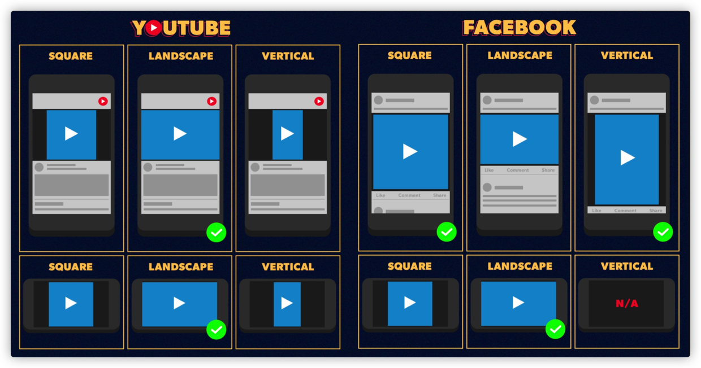

## 7. CSS 滚动捕捉 `scroll-snap-type`

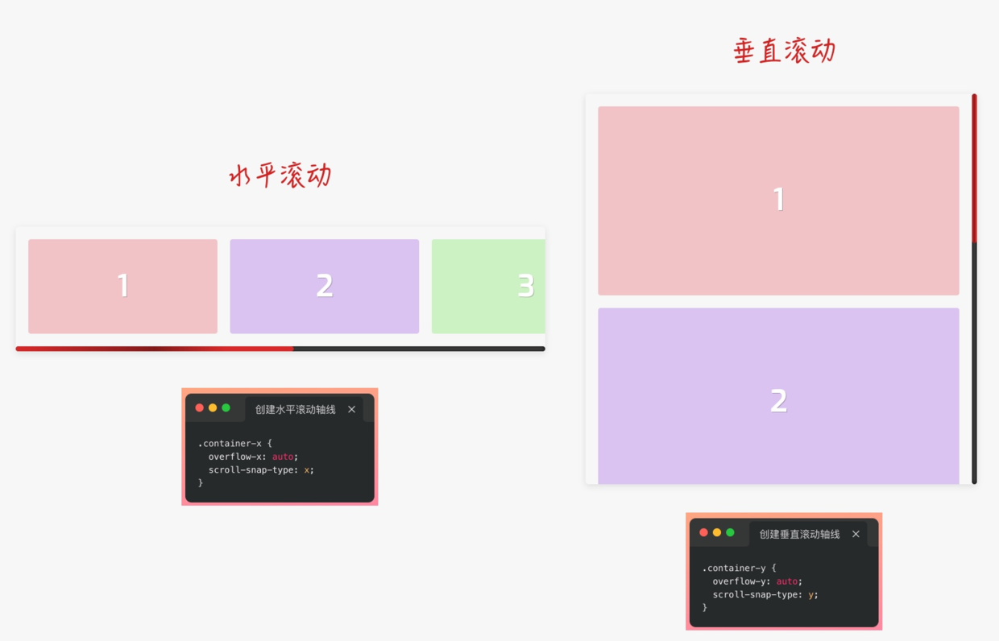

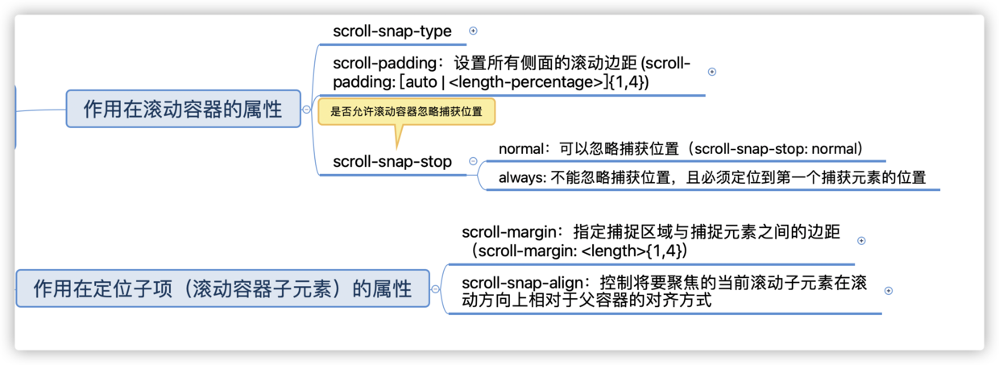

🌰：[实现 h5 滚动效果](https://jsbin.com/kegowevequ/edit?html,output)

```
<!DOCTYPE html>
<html lang="en">
<head>
    <meta charset="UTF-8">
    <meta http-equiv="X-UA-Compatible" content="IE=edge">
    <meta name="viewport" content="width=device-width, initial-scale=1.0">
    <title>Document</title>
    <style>
        * {margin: 0;padding:0;}
       .container {
            height: 100vh;
            overflow-y: auto;
            scroll-behavior: smooth;
            -webkit-overflow-scrolling: touch;
            scroll-snap-type: y mandatory;
            scroll-snap-stop: always;
        }
        /* .container::-webkit-scrollbar {
            display: none;
        } */ 

        .container img {
            height: 100vh;
            width: 100%;
            scroll-snap-align: center;
            vertical-align: middle;
        }


    </style>
</head>
<body>
    <div class="container">
        
        
        
        
        
        
        
      </div>
</body>
</html>
```
> 在电脑上的滚动略有卡顿，手机上体验良好

🌰：Demo: [codepen.io/airen/full/…](https://codepen.io/airen/full/mdRpboo)（图片的中心位置和容器中心位置对齐）
🌰：Demo: [codepen.io/airen/full/…](https://codepen.io/airen/full/PoWQPvN) （ iOS的一些原生交互）
🌰：Demo: [codepen.io/airen/full/…](https://codepen.io/airen/full/qBRxNOo)

## 8. CSS Gap（沟槽）

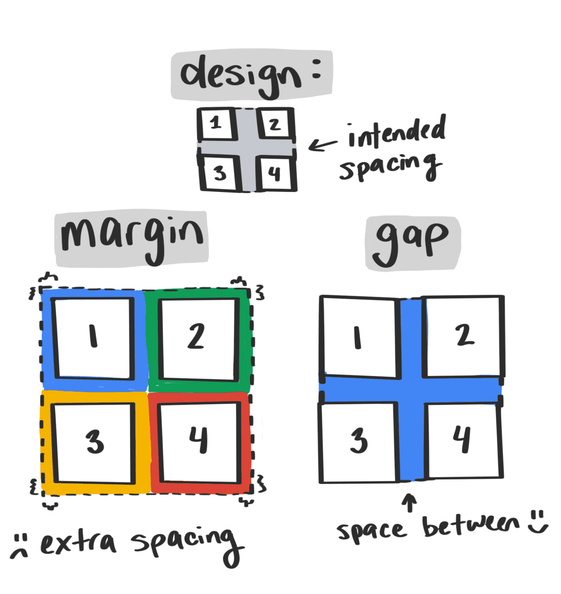

``` CSS
.gap { 
  gap: 10px; 
} 
/* 等同于 */ 
.gap { 
  row-gap: 10px; 
  column-gap: 10px 
} 
```

## 9. CSS 逻辑属性 ~~(个人暂无用处)~~

> 可能在某些国际化需求上会用到

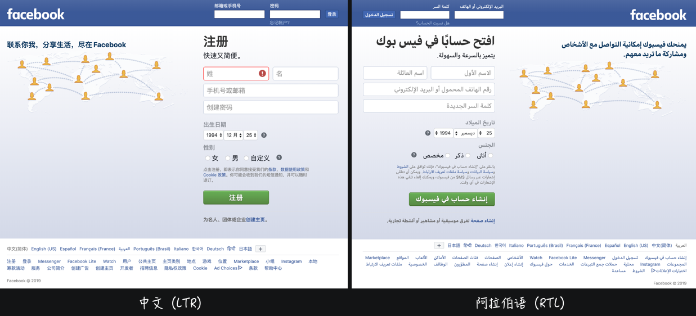

```
<style>
.right {
    direction: rtl;
    unicode-bidi: embed;
}
:is(.right, .left) p {display: inline-block;}
:is(.right, .left) .avatar {
    margin-inline-end: 1rem; // 逻辑属性
    /* 等于以下两句话 */
    /*
    .avatar {
      margin-right: 1rem;
    }
    div[dir="rtl"] .avatar {
      margin-right: 0;
      margin-left: 1rem;
    }
    */
}
</style>
<div>
    <div class="left">
      <p class="avatar">头像</p>
      <p>内容： abcdefg</p>
    </div>
    <div class="right" dir="rtl">
      <p class="avatar">头像</p>
      <p>内容： abcdefg</p>
    </div>
</div>
```

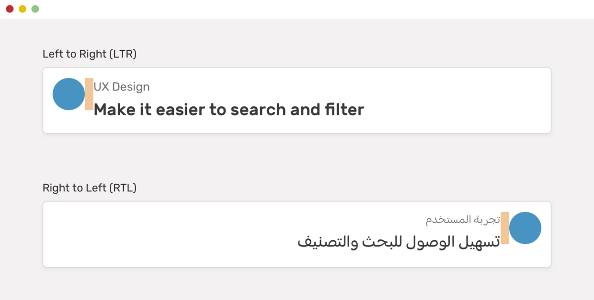


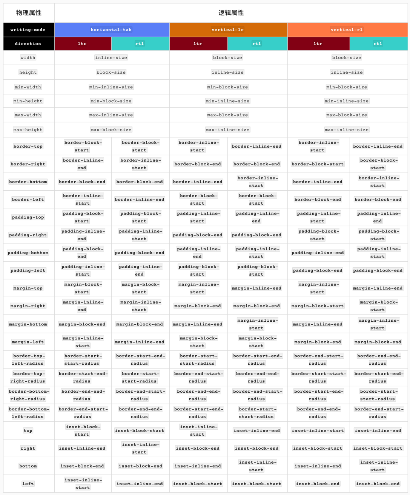

## 10. CSS 比较函数 `min()` 和 `max()` 和 `clamp()`

🌰：`min(50vw, 500px)` 在浏览器视窗宽度改变时，返回的值的变化：

###### clamp(MIN, VAL, MAX)，这三个值之间的关系（或者说取值的方式）：
- 如果 VAL 在 MIN 和 MAX 之间，则使用 VAL 作为函数的返回值
- 如果 VAL 大于 MAX ，则使用 MAX 作为函数的返回值
- 如果 VAL 小于 MIN ，则使用 MIN 作为函数的返回值

``` CSS
.element { 
    width: clamp(100px, 50vw, 500px); 

    /* 50vw相当于视窗宽度的一半，如果视窗宽度是760px的话，那么50vw相当等于380px*/ 
    width: clamp(100px, 380px, 500px); 

    /* 用min()和max()描述*/ 
    width: max(100px, min(380px, 500px));

    /*min(380px, 500px)返回的值是380px*/ 
    width: max(100px, 380px);

    /*max(100px, 380px)返回的值是380px*/ 
    width: 380px; 
}
```
## 11. CSS 内容可见性 `content-visibility` ~~未实测~~

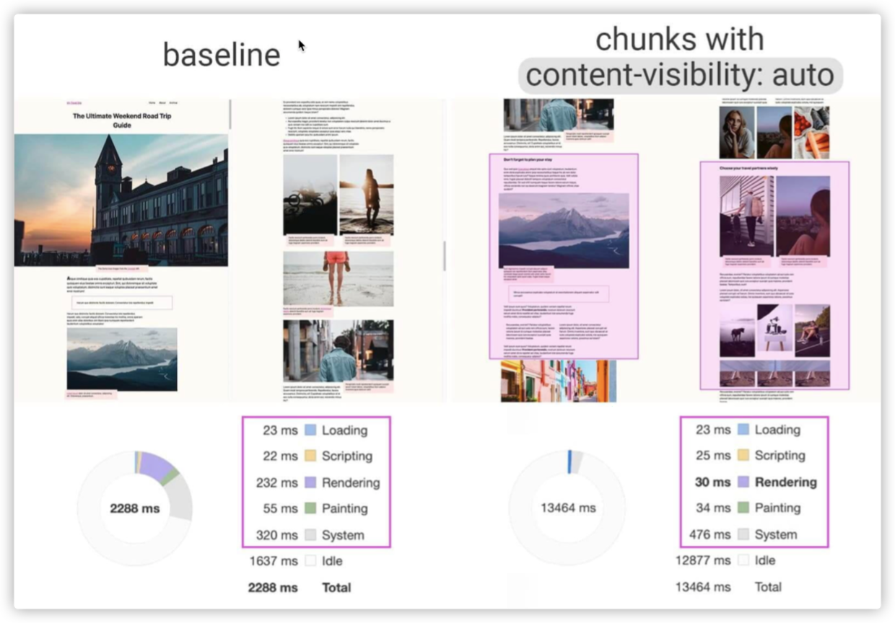

在这种场合下，我们可以使用CSS的 content-visibility 来跳过屏幕外的内容渲染。也就是说，如果你有大量的离屏内容（Off-screen Content），这将会大幅减少页面渲染时间。

```
section {
  content-visibility: auto;
  contain-intrinsic-size: 1000px;
}
```

## 12. CSS 的嵌套 ~~未发布~~

[W3C 也在讨论和定义CSS中的嵌套规则](https://drafts.csswg.org/css-nesting-1/#nest-selector)。目前两种规则：

```
foo {
	color: red;
  
  @nest bar {
  	color: green;
  }
}

// 或者 
foo {
	color: red;
  
  & bar {
  	color: green;
  }
}

// 都等同于
foo {
	color: red;
}

foo bar {
	color: green;
}
```

## 13. [@scope](https://css.oddbird.net/scope/)

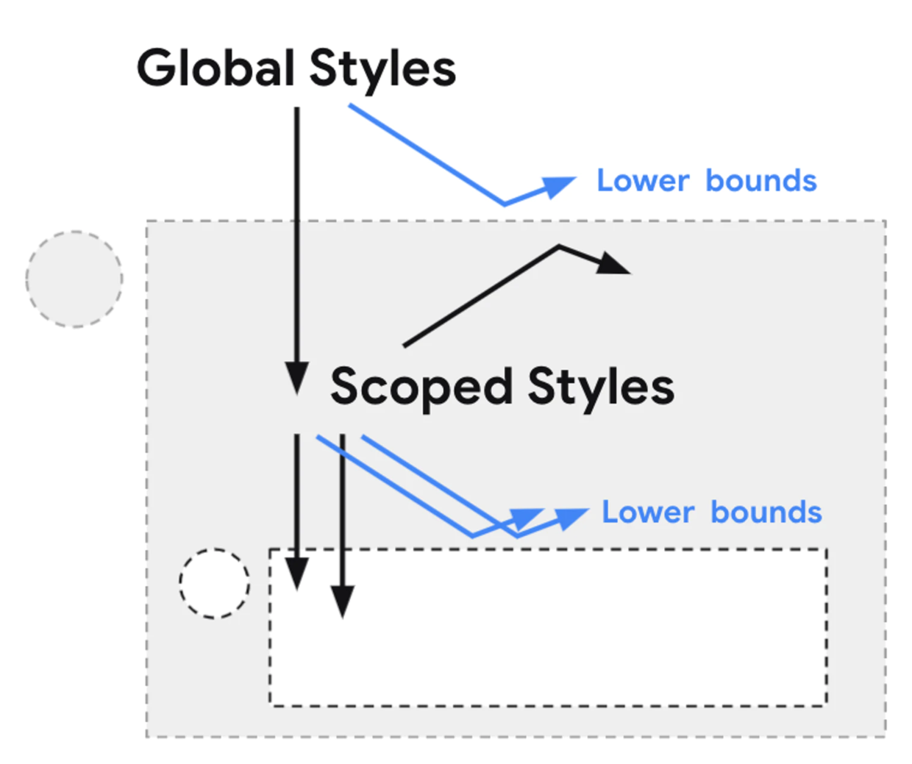

```
/* @scope (<root>#) [to (<boundary>#)]? { … } */

@scope (.tabs) to (.panel) {
  :scope { /* targeting the scope root */ }
  .light-theme :scope .tab { /* contextual styles */ }
}
```


