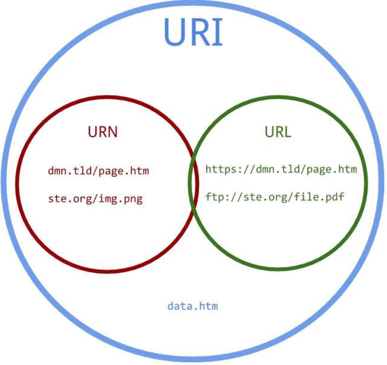

## 初级
--------------
- ##### Http协议是什么？有哪些特点？
>`HTTP` 是一个属于**应用层的面向对象的协议**.
`HTTP` 协议一共有五大特点可概括如下：
1.**支持客户/服务器模式**。
2.**简单快速**：客户向服务器请求服务时，只需传送请求方法和路径。请求方法常用的有 `GET`、 `HEAD`、`POST`。每种方法规定了客户与服务器联系的类型不同。由于 `HTTP` 协议简单，使得 `HTTP` 服务器的程序规模小，因而通信速度很快。
3.**灵活**：`HTTP`允许传输任意类型的数据对象。正在传输的类型由 `Content-Type` 加以标记。
4.**无连接**：无连接的含义是限制每次连接只处理一个请求。服务器处理完客户的请求，并收到客户的应答后，即断开连接。采用这种方式可以节省传输时间。
5.**无状态**：`HTTP`协议是无状态协议。无状态是指协议对于事务处理没有记忆能力。缺少状态意味着如果后续处理需要前面的信息，则它必须重传，这样可能导致每次连接传送的数据量增大。另一方面，在服务器不需要先前信息时它的应答就较快。
[参考](https://www.cnblogs.com/xuxinstyle/p/9813654.html)
- ##### 常见Http方法有哪些？使用场景分别是什么？
>[参考](https://www.cnblogs.com/susanhonly/p/8508596.html)
- ##### GET与POST有什么区别？
>同上
- ##### 在HTML的form 标签里，method支持哪些类型？
- ##### 状态码 200、301、302、304、403、404、500、503分别代表什么？
>[参考](https://blog.csdn.net/a6864657/article/details/80934213)
[参考](https://blog.csdn.net/zll01/article/details/5018413)
- ##### Web安全中有哪些常见的攻击方式？
>1.[XSS](https://www.cnblogs.com/morethink/p/8734103.html#XSS)（关键是脚本，利用恶意脚本发起攻击）------ 存储型和反射型
2.[SQL注入](https://www.cnblogs.com/morethink/p/8734103.html#SQL%E6%B3%A8%E5%85%A5)（关键是通过用SQL语句伪造参数发出攻击）
3.[DDOS](https://www.cnblogs.com/morethink/p/8734103.html#DDOS)（关键是发出大量请求，最后令服务器崩溃）
4.[CSRF](https://www.cnblogs.com/morethink/p/8734103.html#CSRF)（关键是借助本地cookie进行认证，伪造发送请求）
[参考](https://www.cnblogs.com/morethink/p/8734103.html)
- ##### URI和URL的区别？
>“URI可以分为URL,URN或同时具备locators 和names特性的一个东西。URN作用就好像一个人的名字，URL就像一个人的地址。换句话说：URN确定了东西的身份，URL提供了找到它的方式。”
**通俗来说** URI是抽象的定义，不管用什么方法表示，只要能定位一个资源，就叫URI，本来设想的的使用两种方法定位：1，URL，用地址定位；2，URN 用名称定位。

[参考](https://www.zhihu.com/question/21950864)
[参考](http://www.cnblogs.com/hust-ghtao/p/4724885.html)

- ##### 一次完整的Http请求所经历哪些步骤？
>[来这篇文章](https://www.jianshu.com/p/9061e1c1cd2d)
## 中级
-----------------
- ##### 说说Http协议的工作流程
- ##### Http请求报文与响应报文的格式？
- ##### Http首部包含哪些字段？举例说明
- ##### Https的原理是什么？
- ##### 浅析Http和Https的三次握手有什么区别。
- ##### 谈谈Session/cookie机制，如何实现会话跟踪？
- ##### 什么是Web缓存？原理如何？
- ##### OSI有哪七层模型？TCP/IP是哪四层模型。
- ##### 讲一讲TCP协议的三次握手和四次挥手流程。
- ##### 为什么TCP建立连接协议是三次握手，而关闭连接却是四次握手呢？为什么不能用两次握手进行连接？
- ##### websockt是什么？和Http有什么区别？
## 高级
- ##### 什么是非持久连接，什么是持久连接？
- ##### Keep-Alive: timeout=5, max=100是什么意思？
- ##### http1.0，http1.1，http2.0区别（HTTP1.1版本新特性？HTTP2版本新特性？）
- ##### 对Http代理做个介绍？
- ##### 常见的鉴权方式有哪些？