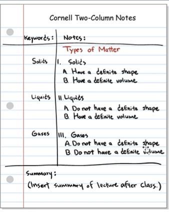
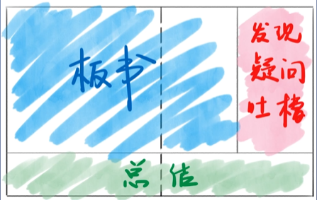
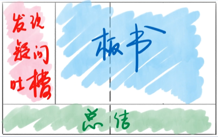

# 不记笔记会怎么样

- **看书不记笔记**
- 白看了
- **看 Vue / React 不记笔记**
- 白看了
- **记笔记的意义**
- 在自己的大脑中设立一个地标
- 你实际上在构建自己的记忆宫殿

# 康奈尔笔记法
- Cornell Notes
- [链接](https://zh.wikipedia.org/zh-hans/%E5%BA%B7%E5%A5%88%E5%B0%94%E7%AC%94%E8%AE%B0%E6%B3%95)
- 《如何在大学学习》一书提到的方法
- 是由康奈尔大学的教授沃尔特发明的基笔记法

## 示例

- **特点**
- 结构：左右下，三分区
- 右边：用于记录
- 左边：索引与自我答疑
- 下边：总结
- **疑问**
- 内容太多咋办？
- 答：拓展为两页纸

#东京大学笔记法

> 竟然就是康奈尔的镜像，也不知道是谁发明的，网上找不到。

> 这俩笔记法如此相像
> 发现与提出疑问很重要
> 总结很重要
> 聪明的人总能找到类似的解决方法

# 吐糟笔记法

- **最简单的办法**
- 将老师的讲的内容简述出来
- 然后揶揄、讽刺、嘲笑的语气发布在公共空间
- **举例**
- 今天的康奈尔笔记法和东京大学笔记法都是三个分区，区别不过就是左撇子和右撇子的区别嘛
- 康奈尔笔记法的发明者居然不叫康奈尔，而是沃尔特，而康奈尔是这所学校的名字啊
