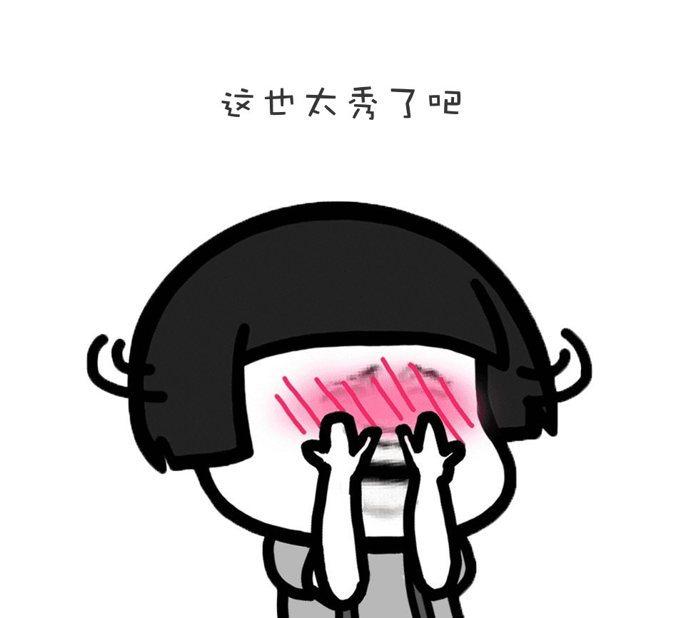
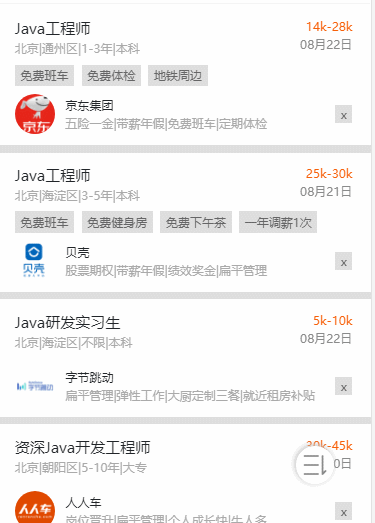

##### 我们依旧从界面及逻辑两块进行分析
1.界面上，只分成简单的两块，一块是上方的刷新文字，一块是下方的内容，然后将上方提示内容隐藏在屏幕之外，一般由两种方式，一种是上面遮一层，另一种是marginTop:负值将其弄出屏幕外，这里我采用的是第一种，代码也很简单，就随便贴一下
```
.header{
    width: 100%;
    height: 1rem;这里的高度应该与刷新文字一样高
    position: fixed;
    z-index: 100;
}
```
2.功能实现的重头戏是在逻辑上，主要分成下面几个部分

- 监听事件
- 位置计算
- 控制界面变化
- 数据更新包
- 我一个一个进行分析，然后带你们入坑。



##### 监听事件，这块简单，直接贴代码
```
//el为下拉的整个节点
//这里为添加监听
this.el.addEventListener('touchstart', this.refreshTouchStart);
this.el.addEventListener('touchmove', this.refreshTouchMove);
this.el.addEventListener('touchend', this.refreshTouchEnd);
//记住在不用的时候要移除监听哦
this.el.removeEventListener('touchstart', this.refreshTouchStart);
this.el.removeEventListener('touchmove', this.refreshTouchMovee);
this.el.removeEventListener('touchend', this.refreshTouchEnd);
//具体的函数，我们直接在位置计算中看
```
位置计算 我们分下拉刷新，上拉加载两块计算，分析可得
###### 下拉刷新的逻辑 = 当前页面的首项在屏幕中且容器向下滑动的距离大于一定值
###### 上拉加载的逻辑 = 当前页面已滑动到底部
好，我们直接看具体的实现逻辑代码

```
//代码中包含界面变化和数据更新，仔细看哦
refreshTouchStart(e) {    
  let touch = e.changedTouches[0];    
  this.tipText = '下拉刷新';
  //下拉提示文字    
  this.startY = touch.clientY;
  //获得当前按下点的纵坐标
}
refreshTouchMove(e) {    
  this.$store.commit('bottomShowFalse');
  //与本逻辑无关，滑动时隐藏底部作用    
  let touch = e.changedTouches[0];    
  let _move = touch.clientY - this.startY;
  //获得滑动的距离    
  this.bottomFlag = $('.present-box').offset().top + $('.present-box').height() - document.body.clientHeight <= 40;
  //滑动到底部标识    
  if ($('.present-box').offset().top >= this.headerHeight) {
    //内容主体超出了一个头部的距离        
      if (_move > 0 && _move < 1000) {
        //滑动距离>0代表下拉
        //<1000是为了防止神人无限拉阿拉            
        this.el.style.marginTop = _move + 'px';
        //根据拉的距离，实现界面上的变化（界面变化）            
        this.moveDistance = touch.clientY - this.startY;
        //记录滑动的距离，在松手后让他滑啊滑滑回去            
        if (_move > 50) {
          //拉到一定程度再下拉刷新，防止误操作                
          this.tipText = '松开即可刷新'//上面有了            
          }        
      }    
  }
}
refreshTouchEnd() {    
  this.$store.commit('bottomShowTrue');
  //松开后底部就biu的出现啦    
  if (this.bottomFlag) {
    //若符合上拉加载的条件，则直接进行数据更新        
    this.$emit('loadBottom');    
  }    
  let that = this;    
  if (this.moveDistance > 50) {
    //拉了一定距离才触发加载动作        
    this.tipText = '数据加载中...';        
    let timer = setInterval(function () {            
      that.el.style.marginTop = that.el.style.marginTop.split('px')[0] - 5 + 'px';
      //如果拉的很长，一次性弹回去影响用户体验，所以先让他弹到50的高度，然后再进行数据更新            
      if (Number(that.el.style.marginTop.split('px')[0]) <= 50) {
        //小于50后就不进行界面变化了，先进行数据更新再变化                
        clearInterval(timer);                
        new Promise((resolve, reject) => {                    
          that.$emit('loadTop', resolve, reject);
          //通知父控件，下拉刷新条件满足了，你更新吧                
        }).then(() => {                  
          that.resetBox();                
        }).catch(() => {                  
          that.resetBox();
          //界面恢复（也就是弹回去啦）                
        });           
      }       
    }, 1);
    //通过一个promise，让数据更新结束后再进行界面变化。也可以采用其他的方式，如async await方式   
  } else {        
    this.resetBox();    
  }
}
resetBox() {    
  let that = this;    
  //使用定时器的方式，biubiubiu的实现滑动界面刷新的效果。    
  if (this.moveDistance > 0) {        
    let timer = setInterval(function () {            
      that.el.style.marginTop = that.el.style.marginTop.split('px')[0] - 1 + 'px';            
      if (Number(that.el.style.marginTop.split('px')[0]) <= 0) {
        clearInterval(timer);
        //这里很重要，不删除，可能看到奇奇怪怪的东西哦 
      }       
    }, 1)    
  }    
  this.moveDistance = 0;    
}

```
##### 效果图



