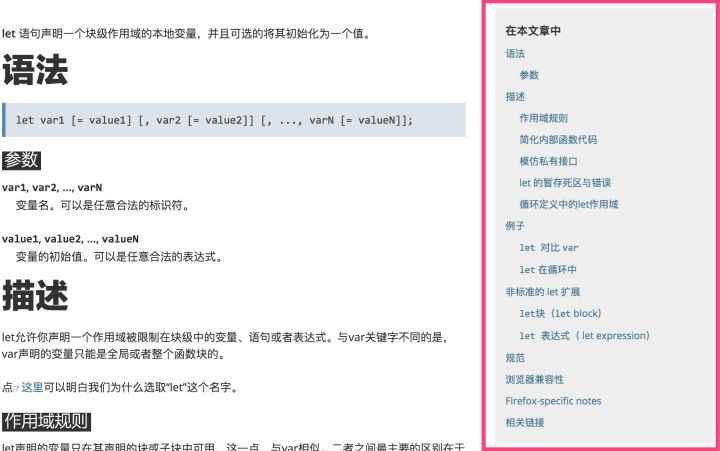
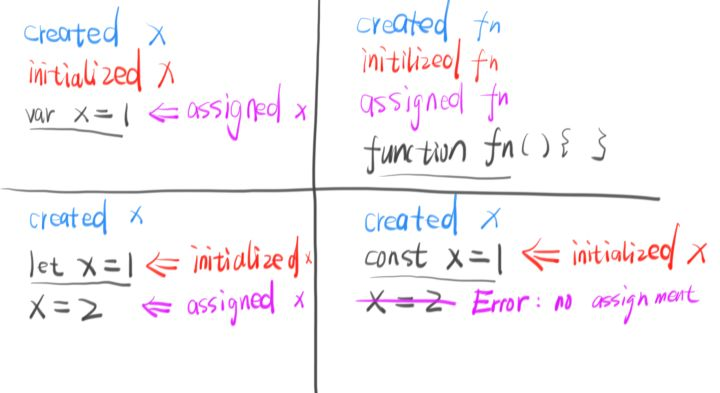
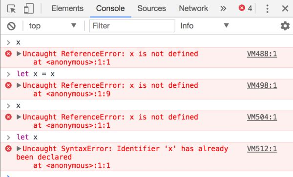

当然不是说用完整的两个月时间来理解 let，而是零零碎碎地理解，同时我还要想着怎么写出一篇文章把这个事情说清楚。

在 let 刚出来的时候，我就「以为」我理解了 let。**然鹅在过去的两个月里，我对 let 的理解发生了一波三折的变化。**

**我写这篇文章，是希望我的学习过程，能对你自学有帮助。**

## 初识 let

跟很多人一样，我第一次了解 let 的特性是从 MDN 的文档：




我得到的信息有这么几条：

*   let 声明的变量的作用域是块级的；
*   let 不能重复声明已存在的变量；
*   let 有暂时死区，不会被提升。

大部分人应该都是这么认为的，我也是这么理解的。

这个理解「没有问题」，但是不够「全面和深刻」。

## 第一次质疑

我第一次质疑我的理解是在遇到 for 循环的时候，代码如下。

```
// 代码段1
var liList = document.querySelectorAll('li') // 共5个li
for( var i=0; i<liList.length; i++){
  liList[i].onclick = function(){
    console.log(i)
  }
}

```

大家都知道依次点击 li [会打印出 5 个 5](https://link.zhihu.com/?target=http%3A//js.jirengu.com/vesat/3/edit%3Fhtml%2Cjs%2Cconsole%2Coutput)。如果把 var i 改成 let i，就会分别[打印出 0、1、2、3、4](https://link.zhihu.com/?target=http%3A//js.jirengu.com/vesat/4/edit%3Fhtml%2Cjs%2Cconsole%2Coutput)：

```
// 代码段2
var liList = document.querySelectorAll('li') // 共5个li
for( let i=0; i<liList.length; i++){
  liList[i].onclick = function(){
    console.log(i)
  }
}

```

**然而，用我之前的知识来理解这个代码是不能自圆其说的**。因为代码中依然只声明了一个 i，在 for 循环结束后，i 的值还是会变成 5 才对。

**这说明我的理解有误。**

于是我去看 MDN 的例子，发现鸡贼的 MDN 巧妙地避开了这个问题，它的例子是这样的：


你看 MDN 的例子，在每次循环的时候用 let j 保留的 i 的值，所以在 i 变化的时候，j 并不会变化。而console.log 的是 j，所以不会出现 5 个 5。

**为什么 MDN 要故意声明一个 j 呢，为什么不直接用 i 呢？**

**我猜测 MDN 为了简化知识，隐瞒了什么。**

于是我去看了看 ES 文档，其中的 [13.7.4.7 章节](https://link.zhihu.com/?target=http%3A//www.ecma-international.org/ecma-262/6.0/%23sec-for-statement-runtime-semantics-labelledevaluation) 清楚地说明了个中缘由，但是由于说得太清楚了，很多人都看不下去，不信你可以试试。

我说一下我的理解：

1.  **for( let i = 0; i< 5; i++) 这句话的圆括号之间，有一个隐藏的作用域**
2.  **for( let i = 0; i< 5; i++) { 循环体 } 在每次执行循环体之前，JS 引擎会把 i 在循环体的上下文中重新声明及初始化一次。**
3.  其他细节就不说了，太细碎了

也就是说上面的代码段2可以**近似近似近似地**理解为

```
// 代码段3
var liList = document.querySelectorAll('li') // 共5个li
for( let i=0; i<liList.length; i++){
  let i = 隐藏作用域中的i // 看这里看这里看这里
  liList[i].onclick = function(){
    console.log(i)
  }
}

```

那样的话，5 次循环，就会有 5 个不同的 i，console.log 出来的 i 当然也是不同的值。

再加上隐藏作用域里的 i，一共有 6 个 i。

这就是 MDN 加那句 let j = i 的原因：方便新人理解。

总得来说就是 let/const 在与 for 一起用时，会有一个 perIterationBindings 的概念（一种语法糖）。

从此之后，我就开始怀疑我对 let 的所有理解了。

## 第二次质疑

我在 StackOverflow 上闲逛的时候，无意中发现了一个是关于「let 到底有没有提升」的问题：

[Are variables declared with let or const not hoisted in ES6?](https://link.zhihu.com/?target=https%3A//stackoverflow.com/questions/31219420/are-variables-declared-with-let-or-const-not-hoisted-in-es6)

其中一个高票回答认为 [JS 中所有的声明（var/let/const/function/class），都存在提升](https://link.zhihu.com/?target=https%3A//stackoverflow.com/a/31222689/1262580)，理由是如下代码：

```
x = "global";
// function scope:
(function() {
    x; // not "global"

    var/let/… x;
}());
// block scope (not for `var`s):
{
    x; // not "global"

    let/const/… x;
}

```

我觉得他说得挺有道理的。于是我又去 MDN 和 ECMAScript 翻了翻，发现两处疑点：

1.  MDN 关于 let 是否存在提升的章节，被编辑了两次，第一次说存在提升，第二次说不存在提升（参考 [2017 年 3 月 10 号的变更记录](https://link.zhihu.com/?target=https%3A//developer.mozilla.org/en-US/docs/Web/JavaScript/Reference/Statements/let%2524compare%3Flocale%3Den-US%26to%3D1242757%26from%3D1242229)）。也就是说 MDN 的维护者都在这个问题上产生过分歧，更何况我们了。
2.  ES 文档里出现了「var/let hoisting」字样。

鉴于此，我认为应该尊重 ES 文档，认为 let 确实存在提升。只不过由于暂时死区的限制，你不能在 let x 之前使用 let（详见我的那篇 [let 声明会提升（hoist）吗？](https://zhuanlan.zhihu.com/p/27558914)）。

## 故事并没有结束

当一个疑问一直存在你脑中时，你会在潜意识中不停地对它进行消化和思考。

上面说到我认为 let 存在提升的主要原因是 ES 文档中出现了「var/let hoisting」字样。

但是我在咨询 TC39 的成员 **<u style="text-decoration: none; border-bottom: 1px dashed gray;">[Rick Waldron](https://link.zhihu.com/?target=https%3A//twitter.com/rwaldron)</u>** 时，他是这么说的：

> You're misunderstanding the intention of that (non-normative) Note. let and const do not hoist as var and function decls do.

而且还细心地专门写了一个 [gist](https://link.zhihu.com/?target=https%3A//gist.github.com/rwaldron/ca35924d59ddc60a6aa165e1e4a3acda) 来详细解释（twitter 有 140 字限制）。

既然 TC39 的 representative 都说了 let hoisting 不是一个正式词汇，那我就应该重新思考一下什么是「提升」了。

于是就有了这篇文章，我想要说一下我对「提升」的理解。你看完之后，就知道 let 到底有没有「提升」。

首先明确一点：提升不是一个技术名词。

要搞清楚提升的本质，需要理解 JS 变量的「创建create、初始化initialize 和赋值assign」

有的地方把创建说成是声明（declare），为了将这个概念与变量声明区别开，我故意不使用声明这个字眼。

有的地方把初始化叫做绑定（binding），但我感觉这个词不如初始化形象。

**我们来看看 var 声明的「创建、初始化和赋值」过程**

假设有如下代码：

```
function fn(){
  var x = 1
  var y = 2
}
fn()

```

在执行 fn 时，会有以下过程（不完全）：

1.  进入 fn，为 fn 创建一个环境。
2.  找到 fn 中所有用 var 声明的变量，在这个环境中「创建」这些变量（即 x 和 y）。
3.  将这些变量「初始化」为 undefined。
4.  开始执行代码
5.  x = 1 将 x 变量「赋值」为 1
6.  y = 2 将 y 变量「赋值」为 2

也就是说 var 声明会在代码执行之前就将「创建变量，并将其初始化为 undefined」。

这就解释了为什么在 var x = 1 之前 console.log(x) 会得到 undefined。

**接下来来看 function 声明的「创建、初始化和赋值」过程**

假设代码如下：

```
fn2()

function fn2(){
  console.log(2)
}

```

JS 引擎会有一下过程：

1.  找到所有用 function 声明的变量，在环境中「创建」这些变量。
2.  将这些变量「初始化」并「赋值」为 function(){ console.log(2) }。
3.  开始执行代码 fn2()

也就是说 function 声明会在代码执行之前就「创建、初始化并赋值」。

**接下来看 let 声明的「创建、初始化和赋值」过程**

假设代码如下：

```
{
  let x = 1
  x = 2
}

```

我们只看 {} 里面的过程：

1.  找到所有用 let 声明的变量，在环境中「创建」这些变量
2.  开始执行代码（注意现在还没有初始化）
3.  执行 x = 1，将 x 「初始化」为 1（这并不是一次赋值，如果代码是 let x，就将 x 初始化为 undefined）
4.  执行 x = 2，对 x 进行「赋值」

这就解释了为什么在 let x 之前使用 x 会报错：

```
let x = 'global'
{
  console.log(x) // Uncaught ReferenceError: x is not defined
  let x = 1
}

```

原因有两个

1.  console.log(x) 中的 x 指的是下面的 x，而不是全局的 x
2.  执行 log 时 x 还没「初始化」，所以不能使用（也就是所谓的暂时死区）

看到这里，你应该明白了 let 到底有没有提升：

1.  let 的「创建」过程被提升了，但是初始化没有提升。
2.  var 的「创建」和「初始化」都被提升了。
3.  function 的「创建」「初始化」和「赋值」都被提升了。

最后看 const，其实 const 和 let 只有一个区别，那就是 const 只有「创建」和「初始化」，没有「赋值」过程。

这四种声明，用下图就可以快速理解：



## 完了吗？

故事依然没有结束，这周我在知乎上问了一个问题：[如何理解 let x = x 报错之后，再次 let x 依然会报错？](https://www.zhihu.com/question/62966713)



这个问题说明：如果 let x 的初始化过程失败了，那么

1.  x 变量就将永远处于 created 状态。
2.  你无法再次对 x 进行初始化（初始化只有一次机会，而那次机会你失败了）。
3.  由于 x 无法被初始化，所以 x 永远处在暂时死区（也就是盗梦空间里的 limbo）！
4.  有人会觉得 JS 坑，怎么能出现这种情况；其实问题不大，因为此时代码已经报错了，后面的代码想执行也没机会。

细节参见另一篇文章：[JS变量封禁大法：薛定谔的X](https://zhuanlan.zhihu.com/p/28117094)

以上，就是一个 let 引发的思考。

重要参考：[JavaScript variables lifecycle: why let is not hoisted](https://link.zhihu.com/?target=https%3A//rainsoft.io/variables-lifecycle-and-why-let-is-not-hoisted/)
>**重要参考：[链接](https://zhuanlan.zhihu.com/p/28140450)**

