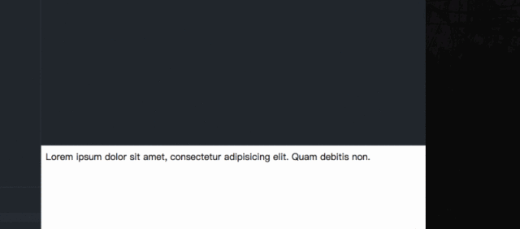
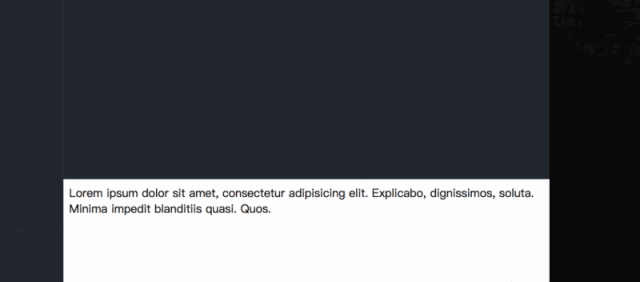
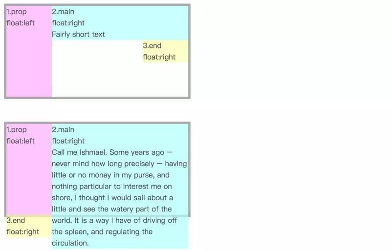
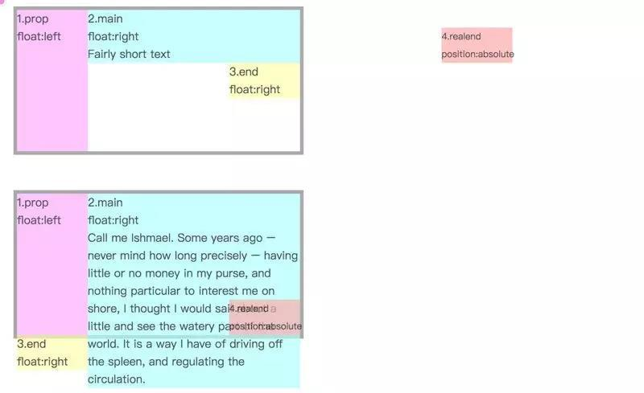
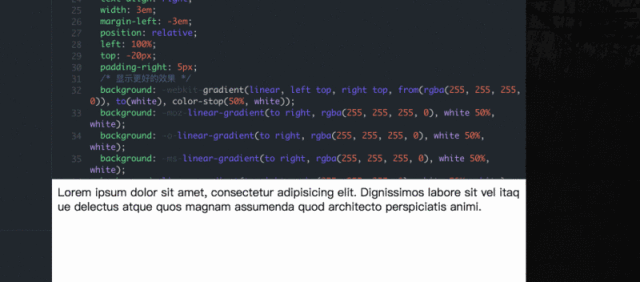

看似十分简单的标题截断效果，但是竟然没有一个统一 CSS 属性实现标准，需要用到一些奇淫妙计来实现，一般来说，在做这样文字截断效果时我们更多是希望：
- 兼容性好，对各大主流浏览器有好的支持
- 响应式截断，根据不同宽度做出调整
- 文本超出范围才显示省略号，否则不显示省略号
- 省略号位置显示刚好

#### *单行文本截断 text-overflow*
文本溢出我们经常用到的应该就是 `text-overflow: ellipsis` 了，相信大家也很熟悉，只需轻松几行代码就可以实现单行文本截断。
```
div {
  white-space: nowrap;
  overflow: hidden;
  text-overflow: ellipsis;
}
```
实现效果：



属性浏览器原生支持，各大浏览器兼容性好，缺点就是只支持单行文本截断，并不支持多行文本截取。

适用场景：单行文字截断最简单实现，效果最好，放心使用。

如果是多行文字截取效果，实现起来就没有那么轻松。
#### *-webkit-line-clamp 实现*
先介绍第一种方式，就是通过 `-webkit-line-clamp` 属性实现。具体的方式如下：
```
div {
  display: -webkit-box;
  overflow: hidden;  
  -webkit-line-clamp: 2;
  -webkit-box-orient: vertical;
}
```
它需要和 `display`、 `-webkit-box-orient` 和 `overflow` 结合使用：

- `display:-webkit-box;` 必须结合的属性，将对象作为弹性伸缩盒子模型显示。
- `-webkit-box-orient;` 必须结合的属性，设置或检索伸缩盒对象的子元素的排列方式。
- `text-overflow:ellipsis;` 可选属性，可以用来多行文本的情况下，用省略号“…”隐藏超出范围的文本。

实现效果：



从效果上来看，它的优点有：

响应式截断，根据不同宽度做出调整。
文本超出范围才显示省略号，否则不显示省略号。
浏览器原生实现，所以省略号位置显示刚好。
但是缺点也是很直接，因为 `-webkit-line-clamp` 是一个不规范的属性，它没有出现在 CSS 规范草案中。也就是说只有 `webkit` 内核的浏览器才支持这个属性，像 Firefox, IE 浏览器统统都不支持这个属性，浏览器兼容性不好。

使用场景：多用于移动端页面，因为移动设备浏览器更多是基于 `webkit` 内核，除了兼容性不好，实现截断的效果不错。
#### *float 特性实现多行文本截断*
基本原理：



有个三个盒子 div，粉色盒子左浮动，浅蓝色盒子和黄色盒子右浮动：

- 当浅蓝色盒子的高度低于粉色盒子，黄色盒子仍会处于浅蓝色盒子右下方。
- 如果浅蓝色盒子文本过多，高度超过了粉色盒子，则黄色盒子不会停留在右下方，而是掉到了粉色盒子下。

好了，这样两种状态的两种展示形式已经区分开了，那么我们可以将黄色盒子进行相对定位，将内容溢出的黄色盒子移动到文本内容右下角，而未溢出的则会被移到外太空去了，只要我们使用 overflow:hidden就可以隐藏掉。



基本原理就是这样，我们可以将浅蓝色区域想象成标题，黄色区域想象为省略号效果。那么你可能会觉得粉色盒子占了空间，那岂不是标题会整体延后了吗，这里可以通过 `margin` 的负值来出来，设置浅蓝色盒子的 `margin-left` 的负值与粉色盒子的宽度相同，标题也能正常显示。

那么我们将前面的 DOM 结构简化下，变成下面这样：
```
<div class="wrap">
  <div class="text">
    Lorem ipsum dolor sit amet, consectetur adipisicing elit. Dignissimos labore sit vel itaque delectus atquequos magnam assumenda quod architecto perspiciatis animi.
  </div>
</div>
```
刚才的粉色盒子和黄色盒子都可以用伪元素来代替。
```
.wrap {
  height: 40px;
  line-height: 20px;
  overflow: hidden;
}
.wrap .text {
  float: right;
  margin-left: -5px;
  width: 100%;
  word-break:break-all;
}
.wrap:: before {
  float: left;
  width: 5px;
  content: '';
  height: 40px;
}
.wrap::after {
  float: right;
  content: "...";
  height: 20px;
  line-height: 20px;
/* 为三个省略号的宽度 */
  width: 3em;
/* 使盒子不占位置 */
  margin-left: -3em;
/* 移动省略号位置 */
  position: relative;
  left: 100%;
  top: -20px;
  padding-right: 5px;
}
```
实现效果：



这里我目前看到最巧妙的方式了。只需要支持 CSS 2.1 的特性就可以了，它的优点有：

- 兼容性好，对各大主流浏览器有好的支持。
- 响应式截断，根据不同宽度做出调整。
- 文本超出范围才显示省略号，否则不显示省略号。

至于缺点，因为我们是模拟省略号，所以显示位置有时候没办法刚刚好，所以可以考虑：

加一个渐变效果，贴合文字，就像上述 demo 效果一样。
添加 `word-break:break-all;` 使一个单词能够在换行时进行拆分，这样文字和省略号贴合效果更佳。
这个方法应该是我看到最好的用纯 CSS 处理的方式了，如果你有更好的方法，欢迎留言交流！


