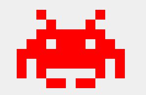

# 筷子css
```swift
<div class="chopsticks"></div>

.chopsticks{
	position: absolute;
	width: 10px;
	height: 250px;
	background-color: #bb8855;
	left: 50%;
	border-radius: 3px;
	box-shadow: 0 0 2px 1px rgba(0,0,0,0.1), 0 -5px 1px 0 rgba(0,0,0,0.1) inset;
}
.chopsticks::before{
	content: '';
	position: absolute;
	width: 10px;
	height: 250px;
	background-color: #bb8855;
	left: 15px;
	border-radius: 3px;
	box-shadow: 0 0 2px 1px rgba(0,0,0,0.1), 0 -5px 1px 0 rgba(0,0,0,0.1) inset;
}
```


# 鸡蛋css
```swift
<div class="egg"></div>

.egg{
        position: absolute;
        top: 20px;
        left: 35px;
        width: 80px;
        height: 100px;
        z-index: 7;        
        background-color: #fff;
        transform:rotate(20deg);
        border-radius: 50%/60% 60% 40% 40%;
    }
.egg::before{
    content: '';
    position: absolute;
    top: 30%;
    left: 21%;
    width: 57%;
    height: 51%;
    background: #FC0;
    border-radius: 50%/56% 60% 41% 44%;
    box-shadow: 0 0 1px 1px #f90,0 0 1px 1px rgba(255, 153, 0, 0.5) inset;
}
```


# 勺子css
```swift
<div class="scoop"></div>

.scoop{
	position: absolute;
	height: 200px;
	width: 20px;
	background-color: #bb8855;
	left: 50%;
	border-radius: 8px;
	box-shadow: 0 0 1px 1px rgba(0,0,0,0.1),0 -5px 1px 1px rgba(0,0,0,0.1) inset;
	top: 10%
}
.scoop::before{
    content: '';
    position: absolute;
    height: 70px;
    width: 59px;
    background-color: #bb8855;
    left: -94%;
    top: -2%;
    border-radius: 50%/60% 60% 40% 40%;
    box-shadow: 0 0 1px 1px rgba(0,0,0,0.1), 0 -3px 3px 2px rgba(0,0,0,0.1) inset;
}
.scoop::after{
    content: '';
    position: absolute;
    height: 14px;
    width: 6px;
    background-color: rgba(0,0,0,0.1);
    left: 49%;
    top: 17%;
    border-radius: 50%/68% 53% 40% 40%;
    box-shadow: 0 0 10px 8px rgba(0,0,0,0.1);
}
```


# 爱心css
```swift
<div class="love">LOVE</div>

.love{
	position: absolute;
	width: 100px;
	height: 100px;
	background-color: #c03;
	left: 40%;
	top: 30%;
    transform: translate(-50%,-50%) rotate(45deg);
    transform: rotate(45deg);
    text-align: center;
    line-height: 100px;
}
.love::before,.love::after{
	content: '';
	position: absolute;
	width: 100px;
	height: 100px;
	background-color: #c03;
	border-radius: 50%;
	left: -50%;
	z-index: -1;
}
.love::after{
    top: -50%;
    left: 0;
}
```


# 气泡css
```swift
<div class="qipao">气泡</div>

.qipao{
	position: absolute;
	width: 200px;
	height: 100px;
	background-color: green;
	border-radius: 7px;
	top: 20%;
	left: 40%;
	text-align: center;
	line-height: 100px;
}
.qipao::before{
	content: '';
	position: absolute;
	bottom: 0;
	left: 50%;
	border: 34px solid transparent;
	border-top-color: green;
	border-bottom: 0;
	border-left: 0;
	margin: 0 0 -34px -17px;
}
```


# 缺四角css
```swift
<div class="angle">缺四角</div>

.angle{
	position: absolute;
	width: 200px;
	height: 150px;
	left: 40%;
	top: 20%;
	background-color: pink;
	text-align: center;
	line-height: 150px;
}

.angle{
	background: 
	linear-gradient(45deg,transparent 15px, pink 0) left bottom,
	linear-gradient(-45deg,transparent 15px,pink 0) right bottom,
	linear-gradient(135deg,transparent 15px,pink 0) left top,
	linear-gradient(-135deg,transparent 15px,pink 0) right top;
    background-size: 50% 50%;
    background-repeat: no-repeat;
}
```


# 缺圆角css
```swift
<div class="arc">缺圆角</div>

.arc{
	position: absolute;
	transform: translate(-50%,-50%);
	top: 50%;
	left: 50%;
	width: 200px;
	height: 150px;
	background-color: pink;
	text-align: center;
	line-height: 150px;
}
.arc{
	background: 
	radial-gradient(circle at left bottom,transparent 15px,pink 0) left bottom,
	radial-gradient(circle at right bottom,transparent 15px,pink 0) right bottom,
	radial-gradient(circle at left top,transparent 15px,pink 0) left top,
	radial-gradient(circle at right top,transparent 15px,pink 0) right top;
	background-size: 50% 50%;
    background-repeat: no-repeat;
}
```


# 梯形css
```swift
<div class="tixing">梯形</div>

.tixing{
      position: absolute;
      top:50%;
      left: 50%;
      transform:translate(-50%,-50%);
      width: 160px;
      padding: 60px;
      text-align: center;
      color: white;
}
.tixing::before{
      content:"";
      position: absolute;
      top: 0; right: 0; bottom: 0; left: 0;
      transform:perspective(40px) scaleY(1.3) rotateX(5deg);
      transform-origin: bottom;
      background:deeppink;
      z-index:-1;

}
```


# 圆盘css
```
<div class="pie">圆盘</div>

.pie{
	position: absolute;
	transform: translate(-50%,-50%);
	top: 50%;
	left: 50%;
	width: 180px;
	height: 180px;
	text-align: center;
	line-height: 180px;
	background-color: pink;
	background-image: linear-gradient(to right, transparent 50%, #655 0);
	border-radius: 50%;
    cursor: pointer;
    overflow: hidden;
}
.pie::before{
	position: absolute;
	content: '';
	background-color: inherit;
	width: 50%;
	height: 100%;
	left: 50%;
	top: 0;
	z-index: -1;
	transform-origin: left;
	transform: rotate(45deg);
}
.pie:hover::before{
	transform: rotate(1000deg);
	transition: transform 5s;
}
```


# 平行四边形css
```swift
<div class="sibianxing">平行四边形</div>

.sibianxing{
	position: absolute;
	top: 50%;
	left: 50%;
	transform: translate(-50%,-50%);
	width: 200px;
	height: 150px;
	line-height: 150px;
	text-align: center;
}


.sibianxing::before{
	content: '';
	position: absolute;
	z-index: -1;
	background-color: pink;
	left: 0;right: 0;top: 0;bottom: 0;
	transform: skew(.08turn);
    
}
```


# 折角css
```swift
<div class="zhejiao">折角</div>

.zhejiao{
	position: absolute;
	width: 200px;
	height: 200px;
	transform: translate(-50%,-50%);
	top: 50%;
	left: 50%;
	text-align: center;
	line-height: 200px;
	background-color: pink;
	border-radius: 10px;
	background:linear-gradient(-150deg,transparent 1.5em, pink 0);
}
.zhejiao::before{
	content: '';
	position: absolute;
	background: linear-gradient(to left bottom,transparent 50%, rgba(0,0,0,.2) 0, rgba(0,0,0,.4)) 100% 0 no-repeat;
	top: 0;
	right: 0;
    width: 30px;
    height: 47px;
    border-bottom-left-radius: 10px;
    transform: translateY(-20px) rotate(-28deg);
    transform-origin: bottom right;
    box-shadow: -.2em .2em .3em -.1em rgba(0,0,0,.15);
}
```


# chrome css
```swift
<div class="chrome"></div>

.chrome{
	position: absolute;
	top: 50%;left: 50%;
	width: 180px;height: 180px;
	transform: translate(-50%, -50%);
	box-shadow:0 0px 4px #999,0 0 2px #ddd inset;
	border-radius:50%;
	background-image:
	radial-gradient(#4FACF5 0%,#2196F3 28%, transparent 28%), 
	radial-gradient(#fff 33%,transparent 33%), 
	linear-gradient(-50deg,yellow 34%, transparent 34%),
	linear-gradient(60deg,green 34%,transparent 34%),
	linear-gradient(176deg,red 34%,transparent 34%),
	linear-gradient(360deg,green 34%,transparent 34%),
	linear-gradient(261deg,yellow 34%,transparent 34%),
	linear-gradient(98deg,red 34%,transparent 34%);
	background-position:0 0;
}
```


# 三根线css
```swift
<div class="warp">
	<div class="one"></div>
	<div class="two"></div>
	<div class="three"></div>
</div>

.warp{width: 170px;height: 150px;position: relative; margin-left: 50%; margin-top: -15%; transform: translate(-50%,-50%);background-color: pink;}
.one, .two, .three{width: 130px;height: 2px;margin: 0 auto; background-color: white; position: absolute;top: 20%;left: 10%;transition:all 1s;}
.two{top: 50%;}
.three{top: 80%;}
.warp:hover .one{top: 80%;opacity: 0;}
.warp:hover .two{top: 20%;transform: rotate(45deg); transform-origin: left; width: 126px}
.warp:hover .three{transform: rotate(-45deg);transform-origin: left; width: 126px;}
```


# 漂浮的云css
```swift
<div class="cloud">乌云</div>

.cloud{
	position: absolute;
	top: 50%;
	left: 50%;
	transform: translate(-50%,-50%);
	width: 150px;
	height: 200px;
	text-align: center;
	background-color: pink;
	border-radius: 10px;
}
.cloud::before{
	position: absolute;
	content: '';
	background-color: white;
	width: 30px;
	height: 30px;
	top: 40%;
	left: 33%;
	z-index: 2;
	border-radius: 50%;
	transform: translate(-50%,-50%);
	box-shadow: 19px 6px 0px 1px white, 14px -13px 0 1px white, 37px -6px 0px -2px white, 52px 4px 0 -4px white, 37px 7px 0 -3px white, 20px -20px #ddd, 38px -12px 0 -1px #ddd, 54px -3px 0 -4px #DDD;
	animation: cloud-move 3s ease-in-out infinite;
}
.cloud::after{
	content: '';
	background-color: rgba(0,0,0,0.6);
	position: absolute;
	top: 70%;
	left: 50%;
	width: 50px;
	height: 6px;
	border-radius: 50%;
	transform: translate(-50%,-50%);
	animation: shadow 3s ease-in-out infinite;
}
@keyframes cloud-move{
	50%{transform: translate(-50%,-10%)};
	100%{transform: translate(-50%,-50%);};
}
@keyframes shadow{
	50%{transform: translate(-50%,-50%) scale(0.6);background-color: rgba(0,0,0,0.3)}
	100%{transform: translate(-50%,-50%) scale(1);background-color: rgba(0,0,0,0.6)}
}
```

# 乱码的字css
```swift
<div class="text-magic" data-word="CSSTextMagic">CSSTextMagic<div class="white"></div><div>

.text-magic{
          position: absolute;
          top: 50%;left: 50%;
          transform: translate(-50%, -50%);
          width:300px;
          font-size:36px;
          font-family:Raleway, Verdana , Arial;
        }
        .white{
          position:absolute;
          left:0;
          top:15px;
          width:100%;
          height:3px;
          background:#fff;
          z-index:4;
          animation:whiteMove 3s ease-out infinite;
        }

        .text-magic:before{
          content:attr(data-word);
          position:absolute;
          top:0;
          left:0.5px;
          height:0px;
          color:rgba(0,0,0,.9);
          overflow:hidden;
          z-index:2;
          animation:redShadow 1s ease-in infinite;
          -webkit-filter:contrast(200%);
          text-shadow:0.1px 0 0 red;
        }

        .text-magic:after{
          content:attr(data-word);
          position:absolute;
          top:0;
          left:-3px;
          height:36px;
          color:rgba(0,0,0,.8);
          overflow:hidden;
          z-index:3;
          background:rgba(255,255,255,.9);
          animation:redHeight 1.5s ease-out infinite;
          -webkit-filter:contrast(200%);
        }

        @keyframes redShadow{
          20%{
            height:32px;
          }
          60%{
            height:6px;
          }
          100%{
            height:42px;
          }
        }

        @keyframes redHeight{
          20%{
            height:42px;
          }
          35%{
            height:12px;
          }
          50%{
            height:40px;
          }
          60%{
            height:20px;
          }
          70%{
            height:34px;
          }
          80%{
            height:22px;
          }
          100%{
            height:0px;
          }
        }

        @keyframes whiteMove{
          8%{
            top:38px;
          }
          10%{
            top:8px;
          }
          12%{
            top:42px;
          }
          99%{
            top:36px;
          }
        }
```


# Infinity

```
#infinity {
      position: relative;
      width: 212px;
      height: 100px;
      box-sizing: content-box;
    }
    #infinity:before,
    #infinity:after {
      content: "";
      box-sizing: content-box;
      position: absolute;
      top: 0;
      left: 0;
      width: 60px;
      height: 60px;
      border: 20px solid red;
      border-radius: 50px 50px 0 50px;
      transform: rotate(-45deg);
    }
    #infinity:after {
      left: auto;
      right: 0;
      border-radius: 50px 50px 50px 0;
      transform: rotate(45deg);
    }
```


# RSS Feed
```
#rss {
    width: 20em;
    height: 20em;
    border-radius: 3em;
    background-color: #ff0000;
    font-size: 14px;
  }
  #rss:before {
    content: '';
    z-index: 1;
    display: block;
    height: 5em;
    width: 5em;
    background: #fff;
    border-radius: 50%;
    position: relative;
    top: 11.5em;
    left: 3.5em;
  }
  #rss:after {
    content: '';
    display: block;
    background: #ff0000;
    width: 13em;
    height: 13em;
    top: -2em;
    left: 3.8em;
    border-radius: 2.5em;
    position: relative;
    box-shadow: 
      -2em 2em 0 0 #fff inset, 
      -4em 4em 0 0 #ff0000 inset,
      -6em 6em 0 0 #fff inset
  }
```


# 奖章
```
 #badge-ribbon {
      position: relative;
      background: red;
      height: 100px;
      width: 100px;
      border-radius: 50px;
    }
    #badge-ribbon:before,
    #badge-ribbon:after {
      content: '';
      position: absolute;
      border-bottom: 70px solid red;
      border-left: 40px solid transparent;
      border-right: 40px solid transparent;
      top: 70px;
      left: -10px;
      transform: rotate(-140deg);
    }
    #badge-ribbon:after {
      left: auto;
      right: -10px;
      transform: rotate(140deg);
    }
```


# 像素怪
```
#space-invader {
      box-shadow: 0 0 0 1em red,
      0 1em 0 1em red,
      -2.5em 1.5em 0 .5em red,
      2.5em 1.5em 0 .5em red,
      -3em -3em 0 0 red,
      3em -3em 0 0 red,
      -2em -2em 0 0 red,
      2em -2em 0 0 red,
      -3em -1em 0 0 red,
      -2em -1em 0 0 red,
      2em -1em 0 0 red,
      3em -1em 0 0 red,
      -4em 0 0 0 red,
      -3em 0 0 0 red,
      3em 0 0 0 red,
      4em 0 0 0 red,
      -5em 1em 0 0 red,
      -4em 1em 0 0 red,
      4em 1em 0 0 red,
      5em 1em 0 0 red,
      -5em 2em 0 0 red,
      5em 2em 0 0 red,
      -5em 3em 0 0 red,
      -3em 3em 0 0 red,
      3em 3em 0 0 red,
      5em 3em 0 0 red,
      -2em 4em 0 0 red,
      -1em 4em 0 0 red,
      1em 4em 0 0 red,
      2em 4em 0 0 red;
      background: red;
      width: 1em;
      height: 1em;
      overflow: hidden;
      margin: 50px 0 70px 65px;
    }
```


# 搜索
```
#magnifying-glass {
      font-size: 10em;
      display: inline-block;
      width: 0.4em;
      box-sizing: content-box;
      height: 0.4em;
      border: 0.1em solid red;
      position: relative;
      border-radius: 0.35em;
    }
    #magnifying-glass:before {
      content: "";
      display: inline-block;
      position: absolute;
      right: -0.25em;
      bottom: -0.1em;
      border-width: 0;
      background: red;
      width: 0.35em;
      height: 0.08em;
      transform: rotate(45deg);
    }
```


# Facebook
```
 #facebook-icon {
      background: red;
      text-indent: -999em;
      width: 100px;
      height: 110px;
      box-sizing: content-box;
      border-radius: 5px;
      position: relative;
      overflow: hidden;
      border: 15px solid red;
      border-bottom: 0;
    }
    #facebook-icon:before {
      content: "/20";
      position: absolute;
      background: red;
      width: 40px;
      height: 90px;
      bottom: -30px;
      right: -37px;
      border: 20px solid #eee;
      border-radius: 25px;
      box-sizing: content-box;
    }
    #facebook-icon:after {
      content: "/20";
      position: absolute;
      width: 55px;
      top: 50px;
      height: 20px;
      background: #eee;
      right: 5px;
      box-sizing: content-box;
    }
```


# 月亮

```
 #moon {
      width: 80px;
      height: 80px;
      border-radius: 50%;
      box-shadow: 15px 15px 0 0 red;
    }
```


# 锁
```
#lock {
  font-size: 8px;
  position: relative;
  width: 18em;
  height: 13em;
  border-radius: 2em;
  top: 10em;
  box-sizing: border-box;
  border: 3.5em solid red;
  border-right-width: 7.5em;
  border-left-width: 7.5em;
  margin: 0 0 6rem 0;
}
#lock:before {
  content: "";
  box-sizing: border-box;
  position: absolute;
  border: 2.5em solid red;
  width: 14em;
  height: 12em;
  left: 50%;
  margin-left: -7em;
  top: -12em;
  border-top-left-radius: 7em;
  border-top-right-radius: 7em;
}
#lock:after {
  content: "";
  box-sizing: border-box;
  position: absolute;
  border: 1em solid red;
  width: 5em;
  height: 8em;
  border-radius: 2.5em;
  left: 50%;
  top: -1em;
  margin-left: -2.5em;
}
```


