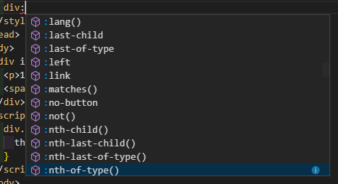

目录（按 `vscode` 中的提示来）





# 伪元素
## 一、 [::after](https://developer.mozilla.org/zh-CN/docs/Web/CSS/::after)
> 常用方法
## 二、 [::backdrop](https://developer.mozilla.org/zh-CN/docs/Web/CSS/::backdrop)
> 设置某些全屏元素的背景
例如视频的全屏后的背景（默认为黑色）我们可以改成[这样](https://www.zhangxinxu.com/study/201812/video-backdrop.php)
> 或者配合 `fullscreen` API，[看这里](https://www.zhangxinxu.com/study/201812/fullscreen-backdrop.php)
其对于背景的控制优先级小于 `:fullscreen`
## 三、 [::before](https://developer.mozilla.org/zh-CN/docs/Web/CSS/::before)
> 常用方法
## 四、 ::content
> 暂无
## 五、 [::cue](https://developer.mozilla.org/zh-CN/docs/Web/CSS/::cue)
> 配合视频中的[字幕](https://developer.mozilla.org/en-US/docs/Web/API/WebVTT_API)用
## 六、 ::cue()
> 暂无
## 七、 ::cue-region
> 暂无
## 八、 ::cue-region()
> 暂无
## 九、 [::first-letter](https://developer.mozilla.org/zh-CN/docs/Web/CSS/::first-letter)
>`::first-letter会`选中某 [block-level element](https://developer.mozilla.org/en-US/docs/Web/CSS/Visual_formatting_model#Block-level_elements_and_block_boxes)（块级元素）第一行的第一个字母，并且文字所处的行之前没有其他内容（如图片和内联的表格）
[体验连接](https://www.zhangxinxu.com/study/201609/first-letter-with-display-value.html)
使用此特性改变第一个字的颜色**[优先级最高](https://www.zhangxinxu.com/study/201609/first-letter-color-important.html)**(高于 `!improtant` )
如果遇到符号会有些意外[情况](https://www.zhangxinxu.com/study/201609/first-letter-special-character.html)
[实际使用栗子](https://www.zhangxinxu.com/study/201609/first-letter-example-no-tag-ui-control.html)
## 十、 [::first-line](https://developer.mozilla.org/zh-CN/docs/Web/CSS/::first-line)
> 基本同上，只不过改变的是第一行颜色
## 十一、 [::grammer-error](https://developer.mozilla.org/zh-CN/docs/Web/CSS/::grammar-error)
> 应用于浏览器标识为语法错误的文本段，**暂无浏览器支持**
## 十二、 [::placeholder](https://developer.mozilla.org/zh-CN/docs/Web/CSS/::placeholder)
> 改变 `placeholder` 文本样式
## 十三、 [::selection](https://developer.mozilla.org/zh-CN/docs/Web/CSS/::selection)
> 改变浏览器对选中的文本[样式](https://codepen.io/melonxx/pen/dLRNob?&editable=true)
> 

## 十四、 ::shadow
> 暂无
## 十五、 [::slotted](https://developer.mozilla.org/zh-CN/docs/Web/CSS/::slotted)
> 用于选定那些被放在 HTML模板 中的元素
## 十六、 [::speclling-error](https://developer.mozilla.org/zh-CN/docs/Web/CSS/::spelling-error)
> 表示浏览器标记为不正确拼写的文本段，**暂无浏览器支持**

# 伪类
## 一、 [:action](https://developer.mozilla.org/zh-CN/docs/Web/CSS/:active)
> 常用方法
## 二、 [:any-link](https://developer.mozilla.org/zh-CN/docs/Web/CSS/:any-link)
> :link 的升级版，它会匹配每一个有 `href` 属性的 [`<a>`](https://developer.mozilla.org/zh-CN/docs/Web/HTML/Element/a "HTML <a> 元素（或称锚元素）可以创建通向其他网页、文件、同一页面内的位置、电子邮件地址或任何其他 URL 的超链接。")、[`<area>`](https://developer.mozilla.org/zh-CN/docs/Web/HTML/Element/area "HTML <area> 元素 在图片上定义一个热点区域，可以关联一个超链接。<area>元素仅在<map>元素内部使用。") 或 [`<link>`](https://developer.mozilla.org/zh-CN/docs/Web/HTML/Element/link "HTML 中<link>元素规定了外部资源与当前文档的关系。 这个元素可用来为导航定义一个关系框架。这个元素最常于链接样式表。") 元素

## 三、 [:blank](https://developer.mozilla.org/zh-CN/docs/Web/CSS/:-moz-only-whitespace)
> 匹配如下节点 1. 没有子节点; 2. 仅有空的文本节点; 3. 仅有空白符的文本节点;
**暂无浏览器支持**
## 四、 [:checked](https://developer.mozilla.org/zh-CN/docs/Web/CSS/:checked)
> 常用方法
## 五、 :corner-persent
> 暂无
## 六、 :decrement
> 暂无
## 七、 [:default](https://developer.mozilla.org/zh-CN/docs/Web/CSS/:default)
> 该选择器可以在 [`<button>`](https://developer.mozilla.org/zh-CN/docs/Web/HTML/Element/button), [`<input type="checkbox">`](https://developer.mozilla.org/en-US/docs/Web/HTML/Element/input/checkbox), [`<input type="radio">`](https://developer.mozilla.org/en-US/docs/Web/HTML/Element/input/radio), 以及 [`<option>`](https://developer.mozilla.org/zh-CN/docs/Web/HTML/Element/option "在web表单中,  HTML元素 <option>  用于定义在<select>,  <optgroup> 或<datalist> 元素中包含的项。<option> 可以在弹出窗口和 html 文档中的其他项目列表中表示菜单项。") 上使用
用于默认选中的样式

## 八、 [:defined](https://developer.mozilla.org/zh-CN/docs/Web/CSS/:defined)
> *测试结果和官方定义有出入*
## 九、 [:dir](https://developer.mozilla.org/zh-CN/docs/Web/CSS/:dir)
> 匹配特定文字书写方向的元素，**暂无浏览器支持**
## 十、 [:disabled](https://developer.mozilla.org/zh-CN/docs/Web/CSS/:disabled)
> 常用方法
## 十一、 :double-button
> 暂无
## 十二、 [:empty](https://developer.mozilla.org/zh-CN/docs/Web/CSS/:empty)
> 常用方法
## 十三、 :enabled
> 常用方法
## 十四、 :end
> 暂无
## 十五、 :first
>  [`@page`](https://developer.mozilla.org/zh-CN/docs/Web/CSS/@page "@page 规则用于在打印文档时修改某些CSS属性。你不能用@page规则来修改所有的CSS属性，而是只能修改margin,orphans,widow 和 page breaks of the document。对其他属性的修改是无效的。")`:first`描述的是：打印文档的时候，第一页的样式。
[栗子](https://codepen.io/anon/pen/pBPZEZ?&editable=true)
## 十六、 [:first-child](https://developer.mozilla.org/zh-CN/docs/Web/CSS/:first-child)
>  常用方法、避免和 `:first` 搞混
## 十七、 [:first-of-type](https://developer.mozilla.org/zh-CN/docs/Web/CSS/:first-of-type)
> 和 `:first-child` 相比表示匹配第一次出现的[元素](https://codepen.io/melonxx/pen/KYqawZ?&editable=true)
## 十八、 [:focus](https://developer.mozilla.org/zh-CN/docs/Web/CSS/:focus)
> 常用方法
## 十八、 [:focus-visible](https://developer.mozilla.org/zh-CN/docs/Web/CSS/:focus-visible)
> 使其仅在键盘(tab)操作时才显示焦点样式 **暂无浏览器支持**
## 十九、 [:focus-within](https://developer.mozilla.org/zh-CN/docs/Web/CSS/:focus-within)
> 捕捉元素的后代元素获得焦点事件 [栗子](https://codepen.io/melonxx/pen/qwjRBG?&editable=true)
## 二十、 [:fullscreen](https://developer.mozilla.org/zh-CN/docs/Web/CSS/:fullscreen)
> fullscreen应用于当前处于全屏显示模式的元素。 它不仅仅选择顶级元素，还包括所有已显示的栈内元素
其对于背景的控制优先级大于 `::backdrop`
## 二十一、 :future
> 暂无
## 二十二、 [:has](https://developer.mozilla.org/zh-CN/docs/Web/CSS/:has)
> **暂无浏览器支持**
## 二十三、 :horizontal
> 暂无
## 二十四、 :host
> 暂无
## 二十五、 [:host()](https://developer.mozilla.org/zh-CN/docs/Web/CSS/:host())
> 配合 `shodow DOM` 使用
## 二十六、 [:host-context()](https://developer.mozilla.org/zh-CN/docs/Web/CSS/:host-context())
> 配合 `shodow DOM` 使用
## 二十七、 :hover
> 常用方法
## 二十八、 [:in-range](https://developer.mozilla.org/zh-CN/docs/Web/CSS/:in-range)
> 代表一个 [`<input>`](https://developer.mozilla.org/zh-CN/docs/Web/HTML/Element/input "HTML <input> 元素用于为基于Web的表单创建交互式控件，以便接受来自用户的数据; 可以使用各种类型的输入数据和控件小部件，具体取决于设备和user agent。") 元素，其当前值处于属性[`min`](https://developer.mozilla.org/zh-CN/docs/Web/HTML/Element/input#attr-min) 和[`max`](https://developer.mozilla.org/zh-CN/docs/Web/HTML/Element/input#attr-max) 限定的范围之内
[栗子](https://codepen.io/melonxx/pen/xergKB?&editable=true)
## 二十九、 :increment
> 暂无
## 三十、 [:indeterminate](https://developer.mozilla.org/zh-CN/docs/Web/CSS/:indeterminate)
> 表示状态不确定的表单元素
> [栗子](https://codepen.io/melonxx/pen/MRoJgV?&editable=true)
## 三十一、 [:invalid](https://developer.mozilla.org/zh-CN/docs/Web/CSS/:invalid)
> 表示任意内容未通过验证的 [`<input>`](https://developer.mozilla.org/zh-CN/docs/Web/HTML/Element/input "HTML <input> 元素用于为基于Web的表单创建交互式控件，以便接受来自用户的数据; 可以使用各种类型的输入数据和控件小部件，具体取决于设备和user agent。") 或其他 [`<form>`](https://developer.mozilla.org/zh-CN/docs/Web/HTML/Element/form "HTML <form> 元素 表示了文档中的一个区域，这个区域包含有交互控制元件，用来向web服务器提交信息。") 元素
[栗子](https://codepen.io/melonxx/pen/vMZgBE?&editable=true)
## 三十二、 [:is](https://developer.mozilla.org/zh-CN/docs/Web/CSS/:is)
> `:matches`
## 三十三、 [:lang()](https://developer.mozilla.org/zh-CN/docs/Web/CSS/:lang)
> 基于元素语言来匹配页面元素
[栗子](https://codepen.io/melonxx/pen/jRwVgG?&editable=true)
## 三十四、 [:last-child](https://developer.mozilla.org/zh-CN/docs/Web/CSS/:last-child)
> 常用方法
## 三十五、 [:last-of-type](https://developer.mozilla.org/zh-CN/docs/Web/CSS/:last-of-type)
> 同理 `:first-of-type` [栗子](https://codepen.io/melonxx/pen/gyRgWg?&editable=true)
## 三十六、 [:left](https://developer.mozilla.org/zh-CN/docs/Web/CSS/:left)
> 同理 `:first`
[`@page`](https://developer.mozilla.org/zh-CN/docs/Web/CSS/@page "@page 规则用于在打印文档时修改某些CSS属性。你不能用@page规则来修改所有的CSS属性，而是只能修改margin,orphans,widow 和 page breaks of the document。对其他属性的修改是无效的。") 配套使用, 对打印文档的左侧页设置CSS样式

## 三十七、 [:link](https://developer.mozilla.org/zh-CN/docs/Web/CSS/:link)
> 常用方法
## 三十八、 [:matches()](https://developer.mozilla.org/zh-CN/docs/Web/CSS/:is)
> 代表集合 例如：
> ```
>/* 选择header, main, footer里的任意一个悬浮状态的段落(p标签) */
>:matches(header, main, footer) p:hover {
>  color: red;
>  cursor: pointer;
>}
>
>/* 以上内容相当于以下内容 */
>header p:hover,
>main p:hover,
>footer p:hover {
>  color: red;
>  cursor: pointer;
>}
>```
> [栗子](https://codepen.io/melonxx/pen/zXzNEQ?&editable=true)
## 三十九、 :no-button
> 暂无
## 四十、 [:not](https://developer.mozilla.org/zh-CN/docs/Web/CSS/:not)
> 常用方法
## 四十一、 [:nth-child](https://developer.mozilla.org/zh-CN/docs/Web/CSS/:nth-child)
> 常用方法
## 四十一、 [:nth-last-child](https://developer.mozilla.org/zh-CN/docs/Web/CSS/:nth-last-child)
> 相比 `:nth-child` 而言，两者顺序相反
## 四十二、 [:nth-of-type](https://developer.mozilla.org/zh-CN/docs/Web/CSS/:nth-of-type)
> 类似 `:first-of-type` 和 `:last-of-type`
## 四十三、 [:nth-last-of-type](https://developer.mozilla.org/zh-CN/docs/Web/CSS/:nth-last-of-type)
> 相比 `:nth-of-type` 而言，两者顺序相反
## 四十四、 [:only-child](https://developer.mozilla.org/zh-CN/docs/Web/CSS/:only-child)
> 属于某个父元素的唯一一个子元素
## 四十五、 [:only-of-type](https://developer.mozilla.org/zh-CN/docs/Web/CSS/:only-of-type)
> 代表了任意一个元素，这个元素没有其他相同类型的兄弟元素。
## 四十六、 [:optional](https://developer.mozilla.org/zh-CN/docs/Web/CSS/:optional)
> 表示任意没有[`required`](https://developer.mozilla.org/zh-CN/docs/Web/HTML/Element/input#attr-required)属性的 [`<input>`](https://developer.mozilla.org/zh-CN/docs/Web/HTML/Element/input "HTML <input> 元素用于为基于Web的表单创建交互式控件，以便接受来自用户的数据。")，[`<select>`](https://developer.mozilla.org/zh-CN/docs/Web/HTML/Element/select "HTML select (<select>) 元素是一种表单控件，可创建选项菜单。菜单内的选项为<option> , 可以由 <optgroup> 元素分组。选项可以被用户预先选择。") 或  [`<textarea>`](https://developer.mozilla.org/zh-CN/docs/Web/HTML/Element/textarea "HTML <textarea> 元素表示一个多行纯文本编辑控件。") 元素使用它。
> 和 `:required` 相反

## 四十七、 [:out-of-range](https://developer.mozilla.org/zh-CN/docs/Web/CSS/:out-of-range)
> 表示一个 [`<input>`](https://developer.mozilla.org/zh-CN/docs/Web/HTML/Element/input "HTML <input> 元素用于为基于Web的表单创建交互式控件，以便接受来自用户的数据; 可以使用各种类型的输入数据和控件小部件，具体取决于设备和user agent。") 元素，其当前值处于属性 [`min`](https://developer.mozilla.org/zh-CN/docs/Web/HTML/Element/input#attr-min) 和 [`max`](https://developer.mozilla.org/zh-CN/docs/Web/HTML/Element/input#attr-max) 限定的范围外
> 和 `:in-range` 相反
## 四十八、 :past
> 暂无
## 四十九、 [:placeholder-shown](https://developer.mozilla.org/zh-CN/docs/Web/CSS/:placeholder-shown)
> 这个伪类好像只能设置 `input` 框外的样式，内部样式(例如 `color` 等)只能用 `::placeholder` 来改变。
## 五十、 [:read-only](https://developer.mozilla.org/zh-CN/docs/Web/CSS/:read-only)
> 表示元素不可被用户编辑的状态（如锁定的文本输入框）
> **注意：这个选择器不只是选择具有 [`readonly`](https://developer.mozilla.org/zh-CN/docs/Web/HTML/Element/input#attr-readonly) 属性的[`<input>`](https://developer.mozilla.org/zh-CN/docs/Web/HTML/Element/input "HTML <input> 元素用于为基于Web的表单创建交互式控件，以便接受来自用户的数据; 可以使用各种类型的输入数据和控件小部件，具体取决于设备和user agent。") 元素，它也会选择所有的不能被用户编辑的元素。**
[栗子](https://codepen.io/melonxx/pen/JVMdOb?&editable=true)
> 与 `:read-write` 相反
## 五十一、 [:read-write](https://developer.mozilla.org/zh-CN/docs/Web/CSS/:read-write)
> 代表一个元素（例如可输入文本的 input元素）可以被用户编辑
> **注意：这个选择器不仅仅选择 [`<input>`](https://developer.mozilla.org/zh-CN/docs/Web/HTML/Element/input "HTML <input> 元素用于为基于Web的表单创建交互式控件，以便接受来自用户的数据; 可以使用各种类型的输入数据和控件小部件，具体取决于设备和user agent。") 元素，它也会选择所有可以被用户编辑的元素，例如设置了 [`contenteditable`](https://developer.mozilla.org/zh-CN/docs/Web/HTML/Global_attributes#attr-contenteditable) 属性的  [`<p>`](https://developer.mozilla.org/zh-CN/docs/Web/HTML/Element/p "HTML <p>元素（或者说 HTML 段落元素）表示文本的一个段落。该元素通常表现为一整块与相邻文本分离的文本，或以垂直的空白隔离或以首行缩进。另外，<p> 是块级元素。") 元素。**
> 与 `:read-only` 相反
## 五十二、 [:required](https://developer.mozilla.org/zh-CN/docs/Web/CSS/:required)
> 表示 任意 [`<input>`](https://developer.mozilla.org/zh-CN/docs/Web/HTML/Element/input "HTML <input> 元素用于为基于Web的表单创建交互式控件，以便接受来自用户的数据; 可以使用各种类型的输入数据和控件小部件，具体取决于设备和user agent。") 元素表示任意拥有[`required`](https://developer.mozilla.org/zh-CN/docs/Web/HTML/Element/input#attr-required)属性的 [`<input>`](https://developer.mozilla.org/zh-CN/docs/Web/HTML/Element/input "input (<input>) 元素用来创建基于web表单的可交互控件.") 或 [`<textarea>`](https://developer.mozilla.org/zh-CN/docs/Web/HTML/Element/textarea "The HTML <textarea> element represents a multi-line plain-text editing control.") 元素使用它. 它允许表单在提交之前容易的展示必填字段并且渲染其外观

## 五十三、 [:right](https://developer.mozilla.org/zh-CN/docs/Web/CSS/:right)
同理 `:first`
[`@page`](https://developer.mozilla.org/zh-CN/docs/Web/CSS/@page "@page 规则用于在打印文档时修改某些CSS属性。你不能用@page规则来修改所有的CSS属性，而是只能修改margin,orphans,widow 和 page breaks of the document。对其他属性的修改是无效的。") 配套使用, 对打印文档的左侧页设置CSS样式

## 五十四、 [:root](https://developer.mozilla.org/zh-CN/docs/Web/CSS/:root)
> 常用方法，一般用于 `css` 变量
## 五十五、 [:scope](https://developer.mozilla.org/zh-CN/docs/Web/CSS/:scope)
> 实验属性，[自行体会](https://codepen.io/melonxx/pen/rbpOYz?&editable=true)
## 五十六、 :single-button
> 暂无
## 五十七、 :start
> 暂无
## 五十八、 [:target](https://developer.mozilla.org/zh-CN/docs/Web/CSS/:target)
> 代表一个唯一的页面元素(目标元素)，其[`id`](https://developer.mozilla.org/zh-CN/docs/Web/HTML/Global_attributes#attr-id) 与当前URL片段匹配
> ```
> 例如, 以下URL拥有一个片段 (以#标识的) ，该片段指向一个ID为section2的页面元素:
> http://www.example.com/index.html#section2
> 
> 若当前URL等于上面的URL，下面的元素可以通过 :target选择器被选中：
> <section id="section2">Example</section>
> ```

## 五十九、 [:valid](https://developer.mozilla.org/zh-CN/docs/Web/CSS/:valid)
> CSS [伪类](https://developer.mozilla.org/en/CSS/Pseudo-classes "Pseudo-classes")表示内容[验证](https://developer.mozilla.org/en/HTML/HTML5/Constraint_validation "en/HTML/HTML5/Constraint_validation")正确的[`<input>`](https://developer.mozilla.org/zh-CN/docs/Web/HTML/Element/input "HTML <input> 元素用于为基于Web的表单创建交互式控件，以便接受来自用户的数据; 可以使用各种类型的输入数据和控件小部件，具体取决于设备和user agent。") 或其他 [`<form>`](https://developer.mozilla.org/zh-CN/docs/Web/HTML/Element/form "HTML <form> 元素 表示了文档中的一个区域，这个区域包含有交互控制元件，用来向web服务器提交信息。") 元素。这能简单地将校验字段展示为一种能让用户辨别出其输入数据的正确性的样式。
> 与 `invalid` 相反
## 六十、 :vertical
> 暂无
## 六十一、 [:visited](https://developer.mozilla.org/zh-CN/docs/Web/CSS/:visited)
> 常见方法
## 六十二、 [:where](https://developer.mozilla.org/zh-CN/docs/Web/CSS/:where)
> 草案阶段
## 六十三、 :window-inactive
> 暂无


